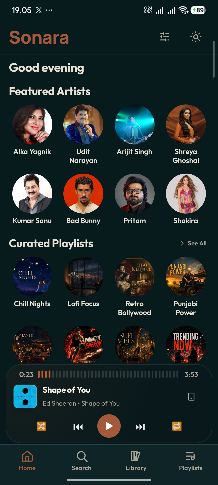
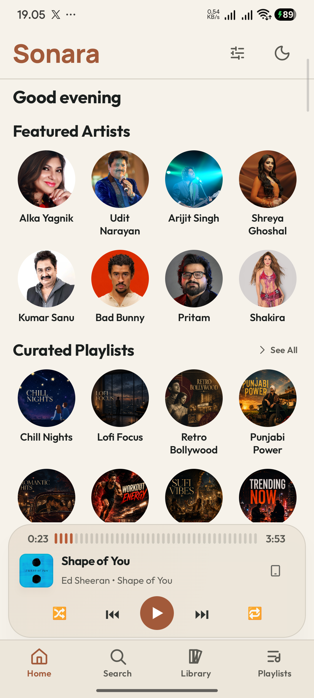

# Sonara

Sonara is an open-source, Android-first music player built with Kotlin and Jetpack Compose. It streams music on-demand, surfaces curated content and personalized recommendations, and combines a native Android client with a self-hosted backend.

## Overview

Sonara is structured around a native Android application and a companion backend. The Android app handles all user interaction, playback, and local data. The Node.js backend acts as the application-facing orchestration layer, exposing a versioned HTTP API to Android. Python services handle the currently implemented YouTube Music search and audio resolution responsibilities. Provider credentials and internal service addresses are kept server-side and are never sent to the Android client.

## Features

The following features are present in the current implementation.

**Playback**
- On-demand music streaming with background playback
- Media notification with playback controls (Media3 MediaSessionService)
- Queue management and reordering
- Audio output selection (speaker, headphones, Bluetooth)
- Playback history and session checkpointing

**Discovery**
- Ranked music search across providers
- Curated playlists (10, with original artwork)
- Featured artists with dedicated artist detail views
- Quick picks and trending content
- Personalized recommendations via ListenBrainz

**Lyrics**
- Synchronized lyrics fetched from [lrclib.net](https://lrclib.net)
- Word-level timing and line sync
- Lyrics offset calibration
- Romanization of Devanagari, Bengali, Gurmukhi, Gujarati, Tamil, Telugu, Kannada, and Malayalam scripts

**Library**
- Liked songs
- User-created playlists
- Listening history
- Offline downloads with download notifications

**Spotify Playlist Import**
- Import playlists exported from Spotify (CSV/file-based)
- Automated track matching against Sonara's music providers
- Review and confirm matches before creating a native Sonara playlist

**UI**
- Material 3 design system with Petrol / Bone / Oxide color palette
- Light and dark themes
- Adaptive layout with bottom navigation bar and navigation rail
- Mini player and full expanded player screen
- Search history

## Screenshots

The following screenshots are baseline design audit captures from the repository.

| Home — Dark | Home — Light |
|---|---|
|  |  |

## Architecture

```
┌─────────────────────────────────┐
│        Sonara Android App       │
│  (Kotlin · Jetpack Compose)     │
└────────────────┬────────────────┘
                 │ HTTP  (dev: LAN · prod: HTTPS via Nginx)
                 ▼
┌─────────────────────────────────┐
│        sonara-backend :3002     │
│  (Node.js · Express)            │
│  Search · Stream · Playlists    │
│  Artists · Import · Identity    │
└──────────┬──────────────────────┘
           │ Internal HTTP (127.0.0.1 only)
     ┌─────┴─────┐
     ▼           ▼
:5000            :5001
YTMusic          yt-dlp audio
service          service
(Python ·        (Python ·
 ytmusicapi)      yt-dlp)
```

The Python services are never exposed to the public internet. Stream URLs are validated against a trusted domain allowlist before being proxied to Android.

## Tech Stack

### Android

| Component | Technology |
|---|---|
| Language | Kotlin |
| UI | Jetpack Compose, Material 3 |
| Playback | Media3 / ExoPlayer, MediaSessionService |
| Local database | Room |
| Preferences | Proto DataStore |
| Image loading | Coil |
| Networking | `java.net.HttpURLConnection` |
| Async | Kotlin Coroutines, Flow |
| Fonts | Manrope, Outfit (OFL-1.1) |
| Min SDK | 26 (Android 8.0+) |
| Target SDK | 35 |

### Backend

| Component | Technology |
|---|---|
| Application server | Node.js ≥ 20, Express |
| Music search | ytmusicapi (Python) |
| Audio resolution | yt-dlp (Python) |
| Streaming | JioSaavn (primary, 320 kbps AAC), YouTube via yt-dlp (fallback) |
| Identity matching | MusicBrainz API |
| Recommendations | ListenBrainz API |
| Process manager (prod) | PM2 |
| Reverse proxy (prod) | Nginx |

## External Services & APIs

| Service / API | Purpose |
|---|---|
| YouTube Music (ytmusicapi) | Music catalog search — queried by the Python YTMusic service |
| YouTube / yt-dlp | Video search and audio stream extraction — queried by the Python audio service |
| JioSaavn | High-quality audio streams (primary source, 320 kbps AAC); falls back to YouTube |
| MusicBrainz | Track and artist identity resolution (MBID lookup, metadata enrichment) |
| ListenBrainz | Seed-based track recommendations (collaborative filtering) |
| LRCLIB | Synchronized lyrics (LRC format, fetched client-side by the Android app) |

> **Note:** Sonara does not use any Spotify APIs. Spotify playlist import is file-based only — no Spotify account, OAuth, or Spotify streaming is involved.

## Project Structure

```
Sonara/
├── app/                        # Android application module
│   └── src/main/
│       ├── java/com/example/sonara/   # Kotlin source
│       └── res/                       # Drawables, fonts, values
├── backend/                    # sonara-backend (Node.js + Python)
│   ├── src/                    # Node.js source
│   │   ├── routes/             # API route handlers
│   │   ├── search/             # Search quality engine
│   │   ├── stream/             # Audio source resolver
│   │   ├── discovery/          # Playlists, eligibility
│   │   ├── identity/           # MusicBrainz matching
│   │   ├── recommendation/     # ListenBrainz integration
│   │   └── import/             # Spotify playlist import matching
│   ├── python/                 # Python services
│   │   ├── ytmusic_service.py  # YTMusic search (port 5000)
│   │   └── youtube_audio_api.py # yt-dlp audio (port 5001)
│   └── scripts/                # Maintenance scripts
├── docs/                       # Design audit captures, specifications
├── assets/                     # Canonical branding assets (SVG/PNG)
├── LICENSE
└── THIRD-PARTY-NOTICES
```

## Getting Started

### Prerequisites

- **Android Studio** (Hedgehog or later recommended)
- **Node.js** ≥ 20
- **Python** ≥ 3.10
- **pip**

### Android

1. Clone the repository and open it in Android Studio.
2. Set the backend URL for your build variant.  
   The backend URL is injected at build time via `BuildConfig.BASE_URL`, which is set in `app/build.gradle.kts`:
   - **Debug builds** default to `http://192.168.0.4:3002` (a specific LAN IP).  
     Update the `buildConfigField` in the `debug` block to match your machine's IP:
     - **Emulator:** `http://10.0.2.2:3002`
     - **Physical device:** `http://192.168.x.x:3002` (your machine's LAN IP)
   - **Release builds** require `SONARA_RELEASE_BACKEND_URL` supplied as a Gradle property (`-PSONARA_RELEASE_BACKEND_URL=https://...`) or environment variable. The URL must start with `https://`.
3. Build and run the `app` module on a device or emulator running Android 8.0 (API 26) or later.

### Backend — Python services

```bash
cd backend/python
pip install -r requirements.txt

# Start the YTMusic service (port 5000)
python ytmusic_service.py

# Start the yt-dlp audio service (port 5001) — in a separate terminal
python youtube_audio_api.py
```

### Backend — Node.js

```bash
cd backend
cp .env.example .env
# Edit .env if needed — defaults work for local development

npm install
npm run dev     # development mode (rate-limiting bypassed)
# npm start     # production mode (rate-limiting active, fail-closed)
```

The server starts on port `3002` by default.

#### Key environment variables

| Variable | Default | Description |
|---|---|---|
| `PORT` | `3002` | Server port |
| `NODE_ENV` | `production` | Runtime environment |
| `PYTHON_YTMUSIC_URL` | `http://127.0.0.1:5000` | YTMusic service address |
| `PYTHON_AUDIO_URL` | `http://127.0.0.1:5001` | yt-dlp audio service address |

See [`backend/.env.example`](backend/.env.example) for all variables.

#### Health check

```bash
npm run check:health
```

#### Tests

```bash
npm test               # all tests
npm run test:unit      # unit tests only
npm run test:security  # security/proxy and rate-limit validation tests
```

## Spotify Playlist Import

Sonara does not provide Spotify account integration or OAuth. The implemented flow is file-based:

1. Export a playlist from Spotify using a Spotify data export tool (e.g., Exportify) — this produces a CSV file.
2. In Sonara, open the import screen and select the exported file.
3. The backend matches each track against Sonara's music providers.
4. Review the match results in the app.
5. Confirm to create a native Sonara playlist.

## Development

### Maintenance scripts

```bash
npm run update:featured-artists      # Refresh featured artist data
npm run update:curated-playlists     # Refresh curated playlist metadata
```

### Production deployment outline

The backend is designed to run behind Nginx (TLS termination) with Python services bound to `127.0.0.1` only. A typical process layout:

```
Internet → HTTPS → Nginx → sonara-backend :3002
                                ↓ (internal)
                       Python :5000 / :5001
```

Manage the Node.js process with PM2:

```bash
pm2 start src/index.js --name sonara-backend
```

Refer to [`backend/README.md`](backend/README.md) for full backend documentation.

## Documentation

Internal documentation is in the `docs/` directory:

- `docs/specifications/` — Design system and component specifications
- `docs/design/` — Design audit screenshots
- `docs/audits/` — Architecture and security audit records
- `docs/archive/` — Phase implementation reports

## Backend API

The Android client communicates with the Node.js backend through a versioned HTTP API. The following endpoints are derived from the current backend route implementation.

All client-facing endpoints are under the `/api/v1/` prefix. No authentication is currently required. Rate limiting is active in production (bypassed in development mode).

---

### Health

| Method | Endpoint | Purpose |
|---|---|---|
| `GET` | `/health` | Lightweight health check. Returns service name, version, and timestamp. |
| `GET` | `/health/deep` | Deep health check — verifies connectivity to the Python services. Returns `200` when healthy, `503` when the backend is degraded. |

---

### Search & Discovery

| Method | Endpoint | Purpose |
|---|---|---|
| `GET` | `/api/v1/search` | Ranked music search via YouTube Music. Results are ordered by the server-side Search Quality Engine. |
| `GET` | `/api/v1/search/videos` | YouTube video search via yt-dlp. Returns playable video results normalized to the same track shape. |
| `GET` | `/api/v1/search/suggestions` | Search-as-you-type suggestions. Proxies YouTube autocomplete. Returns empty on failure rather than an error. |

**`GET /api/v1/search`**
- `q` (required) — search query, max 200 characters
- Rate limited: 60 requests/min in production
- Response: JSON array of `TrackDTO` objects ordered by relevance score

**`GET /api/v1/search/videos`**
- `q` (required) — search query, max 200 characters
- `limit` (optional) — number of results, 1–50, default 10
- Response: `{ items: TrackDTO[] }`

**`GET /api/v1/search/suggestions`**
- `q` (required) — partial search string
- Response: `{ query, suggestions: string[] }` — always returns 200, empty array on failure

---

### Streaming

| Method | Endpoint | Purpose |
|---|---|---|
| `GET` | `/api/v1/stream/resolve` | Resolve a YouTube video ID or URL to a playable audio stream descriptor. |
| `GET` | `/api/v1/stream/play` | Validated audio byte-stream proxy. Streams audio to ExoPlayer with Range request support. |

**`GET /api/v1/stream/resolve`**

Accepts either `url` or `video_id` (at least one required):
- `url` — full YouTube watch URL (e.g. `https://www.youtube.com/watch?v=...`)
- `video_id` — YouTube video ID (e.g. `dQw4w9WgXcQ`)
- `quality` (optional) — `STANDARD` (default, Opus ~160 kbps) or `HIGH` (opportunistic JioSaavn 320 kbps AAC, YouTube fallback)
- `title`, `artist`, `duration` (optional) — metadata hints used for JioSaavn matching

Response: `{ audio_url, trackId, format, codec, bitrate, qualityTier, provider, isDirect, expiresAt }`

> The `audio_url` in the response is the `/api/v1/stream/play` URL to use for actual playback. Stream URLs are ephemeral and must not be persisted.

Rate limited: 20 requests/min in production.

**`GET /api/v1/stream/play`**
- `video_id` (required) — YouTube video ID; validated against a strict pattern
- `audio_url` (required) — the URL from a prior `/stream/resolve` response; validated against a trusted domain allowlist (rejected with 403 otherwise)
- Supports HTTP `Range` headers for ExoPlayer seeking
- Streams raw audio bytes proxied from the upstream provider

---

### Playlists

| Method | Endpoint | Purpose |
|---|---|---|
| `GET` | `/api/v1/playlists` | Curated playlist catalog (summaries only). |
| `GET` | `/api/v1/playlists/:id` | Full detail for one curated playlist including its playable tracks. |

**`GET /api/v1/playlists`**  
Response: `{ playlists: [{ id, name, description, coverImage|null, size }] }`

**`GET /api/v1/playlists/:id`**  
- `:id` — playlist identifier  
Response: `{ id, name, description, coverImage|null, tracks: TrackDTO[] }`

---

### Artists

| Method | Endpoint | Purpose |
|---|---|---|
| `GET` | `/api/v1/artists/featured` | Editorial featured artist roster for the Home screen. |
| `GET` | `/api/v1/artists/:browseId` | Full artist catalog including tracks and associated playlists. |

**`GET /api/v1/artists/featured`**  
Response: `{ featured: [{ id, name, genre, imageUrl|null, browseId|null }] }`  
A `null` `imageUrl` is valid — the client renders a monogram fallback.

**`GET /api/v1/artists/:browseId`**
- `:browseId` — YouTube Music artist browse ID
- `name` (optional query param) — artist name hint for fallback search
- Response: artist catalog including `tracks`, `relatedArtists`, and `playlists`

---

### Quick Picks & Trending

| Method | Endpoint | Purpose |
|---|---|---|
| `GET` | `/api/v1/quickpicks` | Session-stable set of genuinely playable quick-pick tracks. |
| `GET` | `/api/v1/trending` | Trending track feed, resolved to playable YouTube video IDs. |

**`GET /api/v1/quickpicks`**
- `refresh=1` (optional) — bypass the session cache and rotate the fallback query
- Response: `{ quickPicks: TrackDTO[] }` — empty array on provider failure (module self-hides)

**`GET /api/v1/trending`**  
Response: `{ tracks: TrackDTO[] }` — empty array on provider failure

---

### Recommendations

All recommendation endpoints are seed-based. They return tracks related to a given seed track; there is no global personalized feed.

| Method | Endpoint | Purpose |
|---|---|---|
| `GET` | `/api/v1/recommendations/related/:videoId` | YouTube Music "related songs" for a seed track. |
| `GET` | `/api/v1/recommendations/radio/:videoId` | Endless radio seeded from a track. |
| `GET` | `/api/v1/recommendations/similar/:videoId` | ListenBrainz collaborative-filter recommendations for a seed track. |

- `:videoId` — YouTube video ID of the seed track (validated)
- Response envelope: `{ success, tracks: TrackDTO[], ... }`
- Returns HTTP 502 when the upstream provider is unavailable (client module self-hides)

---

### Identity

| Method | Endpoint | Purpose |
|---|---|---|
| `GET` | `/api/v1/identity/resolve` | Resolve a track to its MusicBrainz Recording ID (MBID) and identity metadata. |
| `GET` | `/api/v1/identity/metadata/:mbid` | Fetch enriched MusicBrainz metadata for a known MBID. |

**`GET /api/v1/identity/resolve`**
- `title` (required), `artist` (required), `duration` (optional, seconds) — track metadata
- Response: MusicBrainz identity match including MBID and confidence

**`GET /api/v1/identity/metadata/:mbid`**
- `:mbid` — MusicBrainz Recording ID
- Response: `{ ...immediateMetadata, relationships, releaseGroups }`

---

### Spotify Import

| Method | Endpoint | Purpose |
|---|---|---|
| `POST` | `/api/v1/import/match` | Match a chunk of imported Spotify tracks against Sonara's music providers. |

**`POST /api/v1/import/match`**

Request body (JSON, max 256 KB):
```json
{
  "importId": "string",
  "chunkIndex": 0,
  "tracks": [
    {
      "sourceOrder": 0,
      "title": "string",
      "artist": "string",
      "album": "string (optional)",
      "durationMs": 0,
      "isLocalFile": false,
      "isEpisode": false
    }
  ]
}
```

- Max 50 tracks per chunk request
- Spotify URIs are stripped server-side and never stored or forwarded
- Rate limited: 30 requests/min in production

Response: `{ importId, chunkIndex, results: [{ sourceOrder, status, tier, confidence, resolvedTrack|null, alternatives, reason|null }] }`

Match statuses: `matched`, `ambiguous`, `unmatched`, `skipped`

---

## License

Sonara is free software, released under the **GNU General Public License v3.0 or later**.  
See [`LICENSE`](LICENSE) for the full license text.

Third-party dependency attributions are in [`THIRD-PARTY-NOTICES`](THIRD-PARTY-NOTICES).

Copyright (C) 2026 Rupam Das

## Status

Sonara is in active development. This repository represents the initial public open-source release of the project. No stable production release has been published yet.
