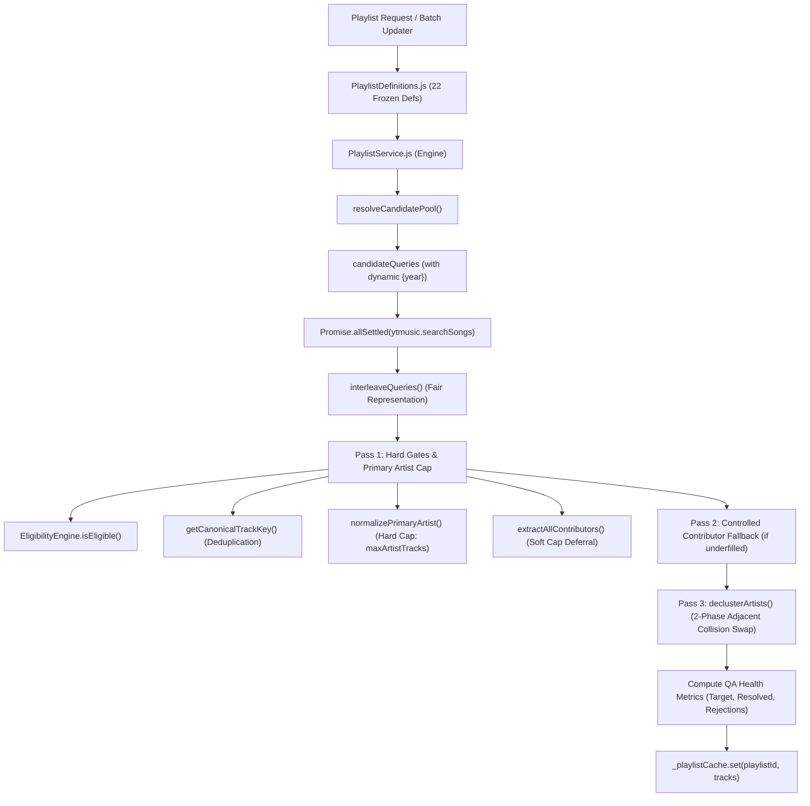

# SONARA — BACKEND OPERATIONAL TOOLING
## PHASE 1: READ-ONLY ARCHITECTURE & REUSE AUDIT

**Document ID**: `AUDIT-SONARA-BACKEND-OPS-PHASE1`  
**Date**: September 7, 2026  
**Status**: Strictly Read-Only Forensic Architecture Audit  
**Author**: Antigravity Pair Programmer (Advanced Agentic Coding)  

---

### EXECUTIVE SUMMARY

This document provides a strictly **read-only forensic investigation** of the Sonara Node.js backend (`backend/src/index.js`) to design three future operational modules:
1. **Featured Artists Updater**
2. **Curated Playlists Data Updater**
3. **API Health & Status Checker**

Zero code modifications, refactorings, deletions, file creations, or dependency changes were made to existing production files during this pass. All findings below are grounded in direct inspection of the codebase.

---

# PART 1 — FEATURED ARTISTS AUDIT

### 1.1 Complete Codebase Flow & Grounded Trace
The Featured Artists subsystem (`backend/src/discovery/featuredArtistsService.js`) implements the Stage 5C / Phase 6 frozen architecture:

```mermaid
graph TD
    Client["Android Client / Router"] -->|GET /api/v1/artists/featured| Route["routes/artists.js"]
    Route -->|getFeaturedArtists()| SWR["featuredArtistsService.js (SWR Gate)"]
    SWR -->|Cache Valid < 24h| ReturnMem["Return in-memory snapshot"]
    SWR -->|Cache Stale > 24h| Mutex["refreshWithLock() (Single-Flight Promise)"]
    Mutex -->|GET /api/charts/artists| Py5000["Python YTMusic Service (:5000)"]
    Py5000 -->|ytmusicapi get_charts()| Upstream["YouTube Music Global Charts"]
    Upstream --> Py5000
    Py5000 --> Mutex
    Mutex --> Gates["Entity Gates: browseId Regex, Blacklist, Fan/Parody Rejection, Dedup"]
    Gates --> Artwork["upgradeAvatarResolution() -> =w540-h540-p-l90-rj"]
    Artwork --> SizeCheck{"Candidates >= 8?"}
    SizeCheck -->|Yes| Select8["Slice Top 8"]
    SizeCheck -->|No| PadAnchors["Pad with CORE_ANCHORS to N=8"]
    Select8 --> UpdateCache["Update _featuredCache (Timestamp & Data)"]
    PadAnchors --> UpdateCache
    UpdateCache --> ReturnMem
```

- **Files Involved**:
  - `backend/src/discovery/featuredArtistsService.js` (Core service, SWR cache, anchor definitions, normalization).
  - `backend/src/routes/artists.js` (API Route: `GET /featured` and `GET /:browseId`).
  - `backend/python/ytmusic_service.py` (Upstream Flask service: `GET /api/charts/artists` at line 213).
  - `backend/src/config/env.js` (`pythonYtmusicUrl`).
  - `backend/tests/discoveryRepairs.test.js` (Unit tests lines 240–302).

- **Exact Classes / Functions / Modules**:
  - `getFeaturedArtists()`: Public entry point with SWR check (`now - _featuredCache.timestamp > ROSTER_TTL_MS`).
  - `refreshWithLock()`: Single-flight mutex wrapper using `_refreshPromise`.
  - `_doRefresh()`: Core resolution pipeline executing upstream fetch, filtering, upscaling, padding, and cache commit.
  - `upgradeAvatarResolution(url)`: Deterministic regex upgrade replacing dimension tokens with `=w540-h540-p-l90-rj` or `=s540-p-l90-rj`.
  - `slugify(name)`: Stable URL-safe slug generation with Unicode NFKD normalization (`replace(/[\u0300-\u036f]/g, '')`).
  - `buildDefaultRoster()`: Constructs initial cold-start roster from `CORE_ANCHORS`.
  - `CORE_ANCHORS`: Array of 6 verified anchor objects (`Arijit Singh`, `Shreya Ghoshal`, `A.R. Rahman`, `Atif Aslam`, `Coldplay`, `The Weeknd`).
  - `ENTITY_BLACKLIST`: Defensive `Set` of 16 lowercase entity names (record labels and lyricists).
  - `FAN_PARODY_RE`: `/(?:fan\s*club|ka\s*fan|official\s*channel|tribute|covers?)$/i`.
  - `BROWSE_ID_RE`: `/^UC[A-Za-z0-9_-]{22}$/`.

- **Operational Mechanics Discovered**:
  - **Candidate Source**: Python endpoint `${config.pythonYtmusicUrl}/api/charts/artists` with a 6-second timeout (`UPSTREAM_TIMEOUT_MS = 6000`).
  - **Deduplication**: Enforced via `seenBrowseIds` (channel ID) and `seenSlugs` (normalized name).
  - **Roster Size**: Enforced to exactly `TARGET_ROSTER_SIZE = 8`. Organic chart candidates take priority; if `< 8`, remaining slots are padded from `CORE_ANCHORS`.
  - **24h Cache / SWR**: `ROSTER_TTL_MS = 86400000`. If stale, returns stale data immediately and asynchronously triggers `refreshWithLock()`.
  - **Last-Known-Good Behavior**: In `_doRefresh()`, if upstream fetch throws or fails, it catches the error, logs a warning, adjusts timestamp for a 5-minute retry (`_featuredCache.timestamp = Date.now() - (ROSTER_TTL_MS - 5 * 60 * 1000)`), and returns the current `_featuredCache.data`. The cold-start fallback is pre-populated with `buildDefaultRoster()`.
  - **Persistence**: Currently held strictly in-memory (`let _featuredCache = { timestamp: 0, data: buildDefaultRoster() }`).

### 1.2 Answers to Part 1 Questions
1. **Single Source of Truth**: `refreshWithLock()` in `featuredArtistsService.js`.
2. **What the Future Updater Must Call**: It must call `refreshWithLock()`. It MUST NOT reimplement chart fetching, regex validation, slugification, blacklist filtering, deduplication, padding, or avatar resolution.
3. **Need for New Business Logic**: **Zero new business logic is needed**. Phase 6 logic is closed and frozen. The updater requires only an operational wrapper (CLI argument parsing, execution telemetry, dry-run mode, and formatted reporting).
4. **Where the Updater Should Live**: In `backend/scripts/update-featured-artists.js` with an underlying service runner in `backend/src/operations/featuredArtistsUpdater.js`.
5. **Invocation Paradigm**: A dual interface: a standalone CLI script callable from the terminal/cron (`npm run update:featured-artists`) AND an exported programmatic service method callable internally or via an authenticated management route.
6. **Inputs / Options**:
   - `--force`: Bypass the 24h TTL and force an immediate upstream refresh.
   - `--dry-run`: Fetch and evaluate upstream chart candidates, report gate statistics, but do not overwrite active cache or disk state.
   - `--json`: Output purely structured JSON machine-readable diagnostics.
   - `--verbose`: Print candidate-by-candidate filtering decisions (e.g. why an entity was blacklisted).
7. **Output / Report**:
   - Status (`SUCCESS`, `STALE_PRESERVED`, `FAILED`).
   - Timestamps (`lastRefreshed`, `expiresAt`, `durationMs`).
   - Counts: total chart candidates received, valid candidates, blacklisted, parody/cover rejected, invalid browseId, duplicate browseId/slug, organic slots filled, anchor slots padded.
   - Final roster table (Rank, Name, Slug, BrowseId, Genre, Avatar Status `UPGRADED_540` / `RAW` / `NULL`, Source `CHART` / `CORE_ANCHOR`).
8. **Failure Preservation**: The updater relies directly on `featuredArtistsService.js` catch block, which retains the existing snapshot and sets a 5-minute retry backoff.
9. **Idempotency**: Running the updater repeatedly with identical upstream chart data produces the exact same deterministic N=8 roster without side effects.
10. **Test Coverage**: Existing tests in `tests/discoveryRepairs.test.js` protect slug normalization, avatar scaling, browseId regex, and DTO shape. Future operational tests must cover: CLI flag parsing (`--force`, `--dry-run`), exit codes, error capture when Python is down, and JSON report structure.

---

# PART 2 — CURATED PLAYLISTS AUDIT

### 2.1 Complete Curated Playlist V2 Pipeline
The Curated Playlists V2 architecture is governed by three primary files:



- **Files Inspected**:
  - `backend/src/discovery/PlaylistDefinitions.js`: Single source of truth for all 22 general curated playlists and 8 artist-specific playlists.
  - `backend/src/discovery/PlaylistService.js`: Core resolution engine (672 lines).
  - `backend/src/discovery/EligibilityEngine.js`: Stateless deterministic gatekeeper (301 lines).
  - `backend/src/routes/playlists.js`: `GET /` and `GET /:id`.
  - `backend/tests/playlists.test.js`: 341 lines covering F-01 to F-10 regression repairs.

- **Key Architectural Findings**:
  - **Catalogue Source of Truth**: Exactly 22 generic playlists (`chill_nights`, `lofi_focus`, `retro_bollywood`, `punjabi_power`, `romantic_hits`, `workout_energy`, `sufi_vibes`, `trending_now`, `fresh_releases`, `arijit_singh`, `uncut_bollywood`, `bollywood_2000s`, `golden_bollywood`, `heartbreak_hindi`, `acoustic_unplugged`, `indie_india`, `desi_hip_hop`, `ghazal_lounge`, `south_blockbusters`, `global_top_hits`, `global_chill`, `ar_rahman_magic`).
  - **Dynamic Year Resolution**: `resolveCandidatePool()` dynamically maps `{year}` tokens at runtime (e.g. for `fresh_releases`), never at boot.
  - **Deduplication**: Dual-layer: `seenVideoIds` (YouTube ID) AND `seenCanonicalKeys` (packaging noise stripped via `getCanonicalTrackKey()`).
  - **Creative Duos**: `CREATIVE_DUOS` in `PlaylistService.js` protects 13 established partnerships (e.g., `Vishal-Shekhar`, `Sachin-Jigar`, `Kalyanji-Anandji`, `Earth, Wind & Fire`) from delimiter splitting.
  - **De-clustering**: `declusterArtists()` performs Phase 1 (forward sweep for interior slots) and Phase 2 (`F-07` penultimate and tail backward swaps for end-of-list conflicts).
  - **Post-Generation QA Metrics**: Already computed at lines 572–586 of `PlaylistService.js` (`targetSize`, `resolvedCount`, `fillPercentage`, `uniquePrimaryArtists`, `candidatesEvaluated`, `rejections`), but currently only logged to stdout via `logger.info` / `logger.warn`.
  - **Cache Lifetime**: `_playlistCache = new BoundedCache({ maxSize: 50, ttlMs: 3600000 })` (1 hour in-memory).

### 2.2 Answers to Part 2 Questions
1. **Function Producing Final Resolved Data for One Playlist**:
   `PlaylistService.generateCuratedPlaylist(playlistId)`.
2. **Function That Can Resolve All 22 Playlists**:
   **None currently exists**. `getAllDefinitions()` returns the array of 22 definitions, but resolution is executed strictly on demand per playlist ID. The future updater must orchestrate batch resolution over `getAllDefinitions().map(d => d.id)`.
3. **Pure Business Logic vs. Operational Concerns**:
   - *Pure Business Logic (FROZEN)*: Search queries, candidate harvesting, canonical key generation, eligibility rules (`EligibilityEngine.js`), artist caps, contributor deferral, de-clustering swaps, cover derivation.
   - *Operational Concerns (NEW)*: Concurrency throttling (avoiding socket exhaustion or upstream 429s), batch iteration over the 22 playlists, per-playlist timing, structured report aggregation, partial failure handling, and optional persistence.
4. **Sufficiency of Existing Infrastructure**:
   **Yes**. `PlaylistService.generateCuratedPlaylist` already performs the heavy lifting and compiles diagnostic metrics (`qaMetrics`). The updater simply needs to drive this function and aggregate its results.
5. **Where Refreshed Playlist Data Should Live**:
   Currently, it lives in `PlaylistService._playlistCache` (in-memory). For operational persistence across restarts or out-of-process CLI runs, the updater should optionally persist a snapshot file (e.g., `data/curated_playlists_store.json` following the pattern of `data/identity_store.json`) or prime the in-memory cache of the running server via a local admin hook.
6. **Partial Failure Semantics**:
   Each playlist resolves completely independently. If 21 succeed and 1 fails, the 21 must be committed and cached. The failed playlist should preserve its previous cache snapshot (or report failure).
7. **Committing Successful Results**:
   **Yes**. Never discard 21 valid playlists because 1 experienced an upstream timeout.
8. **Reporting Underfilled Playlists**:
   Compare `resolvedCount` against `definition.size`. Playlists with `resolvedCount < targetSize` are classified as `UNDERFILLED` (known baseline: Retro Bollywood: 25/30, Golden Bollywood: 19/30, Ghazal Lounge: 20/25).
9. **Surfacing Diagnostic Rejection Counts**:
   Expose the `rejections` dictionary from `generateCuratedPlaylist`: `duplicate_video_id`, `duplicate_canonical`, `duration_too_short`, `duration_too_long`, `spoken_word_not_allowed`, `megamix_not_allowed`, `teaser_not_allowed`, `format_junk_not_allowed`, `remix_not_allowed`, `max_artist_tracks`, `contributor_deferred`.
10. **Preserving Frozen Eligibility Semantics**:
    Do not touch `EligibilityEngine.js` or `PlaylistDefinitions.js`. The updater only invokes `PlaylistService.generateCuratedPlaylist()`.
11. **Existing Test Coverage**: `tests/playlists.test.js` (341 tests validating F-01 to F-10).
12. **Additional Tests Required**: Tests for batch orchestrator loop, throttled concurrency, partial failure isolation, CLI argument parser, and report formatting.

### 2.3 Proposed Report Format Grounding
The existing `PlaylistService.js` internal metrics directly supply every metric required for the operational report:

```text
======================================================================
SONARA CURATED PLAYLISTS V2 — DATA UPDATE REPORT
Timestamp: 2026-09-07T08:35:00.000Z
Duration:  14,250ms
======================================================================
Summary: 22 playlists processed
  Fully Populated: 19
  Underfilled:      3 (Known Catalog Baseline)
  Failed:           0
  Overall Fill:    564 / 585 tracks (96.4%)
----------------------------------------------------------------------
Details:
- chill_nights:         25/25 (100%) | Dup: 14 | Rej: 32 | Collisions Fixed: 1 | Latency: 580ms | OK
- lofi_focus:           25/25 (100%) | Dup:  8 | Rej: 19 | Collisions Fixed: 0 | Latency: 490ms | OK
- retro_bollywood:      25/30  (83%) | Dup: 22 | Rej: 61 | Collisions Fixed: 2 | Latency: 720ms | UNDERFILLED
- golden_bollywood:     19/30  (63%) | Dup: 31 | Rej: 84 | Collisions Fixed: 1 | Latency: 810ms | UNDERFILLED
- ghazal_lounge:        20/25  (80%) | Dup: 16 | Rej: 45 | Collisions Fixed: 0 | Latency: 640ms | UNDERFILLED
... [17 additional playlists] ...
----------------------------------------------------------------------
Integrity Invariants Verified:
  [PASS] 0 Video-ID Duplicates
  [PASS] 0 Canonical Track Duplicates
  [PASS] 0 Adjacent Artist Collisions
======================================================================
```

---

# PART 3 — API HEALTH & STATUS AUDIT

### 3.1 Backend Surface Mapping
Inspection of `backend/src/index.js`, routes, and provider layers reveals:

| Subsystem / Route | File / Entry Point | Upstream / Dependency | Port / Protocol | Protocol / Method |
| :--- | :--- | :--- | :--- | :--- |
| **Server Root & Health** | `src/index.js` | None (Local Express) | Port 3002 | `GET /health` |
| **Search (Tracks)** | `src/routes/search.js` | `python/ytmusic_service.py` | Port 5000 (HTTP) | Native `fetch` to `/api/search` |
| **Search (Videos)** | `src/routes/search.js` | `python/youtube_audio_api.py` | Port 5001 (HTTP) | Native `fetch` to `/search-youtube` |
| **Search Suggestions**| `src/routes/search.js` | Google Suggest API | External HTTPS | `suggestqueries.google.com` |
| **Stream Resolve** | `src/routes/stream.js` | `AudioSourceResolver.js` | Mixed | JioSaavn API or Python :5001 |
| **Stream Proxy** | `src/routes/stream.js` | `python/youtube_audio_api.py` | Port 5001 (HTTP) | Stream pipe to `/stream-youtube-audio` |
| **Curated Playlists** | `src/routes/playlists.js` | `PlaylistService.js` -> Python | Port 5000 (HTTP) | Multi-query `ytmusic.searchSongs` |
| **Featured Artists** | `src/routes/artists.js` | `featuredArtistsService.js` | Port 5000 (HTTP) | `GET /api/charts/artists` |
| **Artist Deep Catalog**| `src/routes/artists.js` | `artistCatalogService.js` | Port 5000 (HTTP) | `GET /api/artist-catalog-deep` |
| **Trending Feed** | `src/routes/trending.js` | JioSaavn V2 Mirror -> Python | External / Port 5000 | `jiosaavn.rajputhemant.dev` -> YT resolve |
| **Quick Picks** | `src/routes/quickpicks.js`| `quickPicksService.js` -> Python | Port 5000 (HTTP) | `ytmusic.searchSongs` |
| **Identity Resolution**| `src/routes/identity.js` | `MusicBrainzService.js` | External HTTPS | `musicbrainz.org/ws/2` (1 req/s) |
| **Identity Store** | `src/identity/IdentityStore.js`| Local File System | Local Disk | `backend/data/identity_store.json` |
| **Recommendations** | `src/routes/recommendations.js`| `recommendationService.js` | Port 5000 / External | Python :5000 + ListenBrainz (3 req/s) |

### 3.2 Dependency Classification

| Dependency | Classification | Rationale & Probe Feasibility |
| :--- | :--- | :--- |
| **Local Node Process & Memory** | `HEALTHY-CHECKABLE` | Local check: uptime, RSS memory, event loop lag, file access permissions. |
| **Identity Store Disk Persistence**| `HEALTHY-CHECKABLE` | Local check: check if `data/identity_store.json` exists and is readable/writable. |
| **Python YTMusic Service (:5000)** | `HEALTHY-CHECKABLE` | Lightweight HTTP GET to `${config.pythonYtmusicUrl}/health`. Fast (<15ms), zero side-effects. |
| **Python YouTube Audio (:5001)** | `HEALTHY-CHECKABLE` | Lightweight HTTP GET to `${config.pythonAudioUrl}/`. Verifies Flask & yt-dlp service responsiveness (<15ms). |
| **JioSaavn Stream Provider** | `DEGRADED-CHECKABLE` | Non-critical fallback. Check local circuit breaker state (`circuitState`). Optional probe: HEAD/GET to API endpoint with 1.5s timeout. If down, system is DEGRADED, not DOWN. |
| **JioSaavn Trending Mirror** | `DEGRADED-CHECKABLE` | Non-critical editorial feed. Lightweight probe to `${JIOSAAVN_V2_BASE}` with short timeout. If down, trending falls back gracefully. |
| **ListenBrainz API** | `DEGRADED-CHECKABLE` | Non-critical recommendation enricher. Check local rate limiter queue and optional ping to `api.listenbrainz.org/1/core/listen-count` (or similar). Respect 3 req/s. |
| **Google Suggest API** | `DEGRADED-CHECKABLE` | Fast external autocomplete. Probe with lightweight test token `q=a`. Non-fatal if blocked. |
| **MusicBrainz API** | `DEGRADED-CHECKABLE` | **High risk**. Strict 1 req/s rate limit. Do NOT poll repeatedly. Check local rate limiter queue metrics and error counters. Only perform network ping on explicit demand. |
| **Google Video CDN** | `NOT-CHECKABLE` | Stream URLs are dynamic, signed, IP-bound, and ephemeral. Attempting to download media is abusive, slow, and non-informative. |
| **Sonara Web (:3001)** | `NOT-APPLICABLE` | Explicitly documented in `index.js`: Sonara Android does not connect to Web backend on :3001. |

### 3.3 Health Architecture: Status Model & Check Tiers

- **Status Taxonomy**:
  - `HEALTHY`: Node server, Python :5000 (YTMusic), Python :5001 (Audio), and `data/` storage are fully operational. All core user journeys (Search, Stream, Playlists, Featured) work.
  - `DEGRADED`: Core is operational, but one or more optional/opportunistic providers (JioSaavn 320kbps, ListenBrainz recommendations, Trending mirror) are unreachable or circuit breaker is OPEN. Playback falls back to YouTube 160kbps baseline; user experience is intact.
  - `DOWN`: Node process cannot reach Python :5000 or Python :5001, or filesystem is read-only. Search and streaming cannot function.
  - `NOT_CONFIGURED`: Required environment variables (`PORT`, `PYTHON_YTMUSIC_URL`, `PYTHON_AUDIO_URL`) missing or invalid.

- **Check Tiers**:
  1. **Tier 1: Local-Only Invariants (0ms, Zero Network Egress)**:
     - Process uptime, heap memory usage, Node version (`>= 20`).
     - Filesystem check on `backend/data/identity_store.json`.
     - In-memory cache sizes and hit rates (`_featuredCache`, `_playlistCache`, `matchCache`, `negativeCache`).
     - Circuit breaker states (`JioSaavnStreamProvider.circuitState`).
  2. **Tier 2: Internal Microservice Probes (<20ms, Loopback Network)**:
     - HTTP GET `http://127.0.0.1:5000/health` (YTMusic microservice).
     - HTTP GET `http://127.0.0.1:5001/` (YouTube audio extraction microservice).
  3. **Tier 3: External Integration Probes (Strict 1500ms Timeout, Gated)**:
     - Lightweight ping to Google Suggest API.
     - Lightweight ping to JioSaavn API.
     - Rate-limiter queue inspection for MusicBrainz & ListenBrainz (NO aggressive network polling).

---

# PART 4 — ARCHITECTURE & REUSE ANALYSIS

### 4.1 Categorization Matrix

| Category | Components & Logic |
| :--- | :--- |
| **A. Existing Logic to Reuse** | - `featuredArtistsService.refreshWithLock()` (Trigger SWR update)<br>- `featuredArtistsService.getFeaturedArtists()` (Read roster)<br>- `featuredArtistsService.CORE_ANCHORS` (Anchor reference)<br>- `PlaylistService.generateCuratedPlaylist(id)` (Single playlist resolver)<br>- `PlaylistService.getPlaylistCover(id)` (Cover resolver)<br>- `PlaylistDefinitions.getAllDefinitions()` (22 catalog definitions)<br>- `PlaylistDefinitions.getDefinitionById(id)` (Definition lookup)<br>- `EligibilityEngine.isEligible()` (Deterministic filtering)<br>- `utils/logger.js` (Structured JSON logging)<br>- `config/env.js` (Validated environment configuration) |
| **B. Frozen Logic to Never Touch** | - `CORE_ANCHORS` list (6 anchors)<br>- Target roster size `N=8`<br>- Avatar upgrade regex `=w540-h540-p-l90-rj`<br>- 24h SWR cache semantics in `featuredArtistsService`<br>- 22 curated playlist definitions in `PlaylistDefinitions.js`<br>- `CREATIVE_DUOS` dictionary in `PlaylistService.js`<br>- Canonical track key algorithm `getCanonicalTrackKey()`<br>- 2-phase declustering algorithm `declusterArtists()`<br>- Duration bounds (90s–480s/720s) and compound regexes in `EligibilityEngine.js` |
| **C. New Operational Logic Required** | - Operational CLI runner for Featured Artists with flags (`--force`, `--dry-run`, `--json`)<br>- Curated Playlists batch orchestrator iterating 22 definitions with throttled concurrency (`p-limit` style or small pool)<br>- Curated Playlists QA report formatter (Markdown and JSON output)<br>- Multi-tier Health Checker engine probing Tier 1, Tier 2, and Tier 3 with latency measurement and error categorization<br>- Operational CLI runner for Health Checker (`scripts/check-api-health.js`) |
| **D. Duplication Risks to Avoid** | - **DO NOT** create a new YouTube search/chart client.<br>- **DO NOT** create a second playlist track generator.<br>- **DO NOT** create duplicate eligibility or duration rules.<br>- **DO NOT** create parallel artist declustering or deduplication scripts.<br>- **DO NOT** download full audio files to check stream health.<br>- **DO NOT** introduce a database/ORM for operational data. |
| **E. Shared Infrastructure to Create** | - `backend/src/operations/`: Clean home for operational engines (`healthChecker.js`, `curatedPlaylistsUpdater.js`, `featuredArtistsUpdater.js`).<br>- Minimal concurrency limiter helper for batch playlist resolution (native Promise chunking). |
| **F. Things That Should NOT Be Abstracted** | - Do not build a generic "Plugin/Task Engine" abstraction.<br>- Do not introduce distributed task queues (Redis/BullMQ/RabbitMQ).<br>- Do not abstract health check into an enterprise telemetry framework. |

---

# PART 5 — PROPOSED DIRECTORY STRUCTURE

Following existing repository conventions (`backend/src/`, `backend/tests/`, package scripts), the cleanest, non-fragmenting structure is:

```
backend/
├── scripts/                              # CLI operational entry points
│   ├── check-api-health.js               # CLI wrapper for API Health & Status
│   ├── update-featured-artists.js        # CLI wrapper for Featured Artists Updater
│   └── update-curated-playlists.js       # CLI wrapper for Curated Playlists Data Updater
│
├── src/
│   ├── operations/                       # Pure operational service engines (reusable by CLI or API)
│   │   ├── healthChecker.js              # Multi-tier health probe orchestrator
│   │   ├── featuredArtistsUpdater.js     # Featured artists operational runner & reporter
│   │   └── curatedPlaylistsUpdater.js    # Batch playlist resolution & QA metrics aggregator
│   │
│   ├── discovery/                        # [FROZEN] Existing business logic
│   │   ├── featuredArtistsService.js     # [REUSED] Core roster & SWR
│   │   ├── PlaylistDefinitions.js        # [REUSED] 22 definitions
│   │   ├── PlaylistService.js            # [REUSED] Resolution & de-clustering
│   │   └── EligibilityEngine.js          # [REUSED] Filtering gates
│   │
│   └── ...                               # [UNTOUCHED] routes, stream, identity, etc.
│
└── tests/
    └── operations/                       # Operational module test coverage
        ├── healthChecker.test.js         # Health probe and classification tests
        ├── featuredArtistsUpdater.test.js# Featured artists updater runner tests
        └── curatedPlaylistsUpdater.test.js# Curated playlists batch & reporting tests
```

### Rationale for Every Proposed File
1. `src/operations/healthChecker.js`: Houses the diagnostic probe functions (Tier 1/2/3), computes `HEALTHY`/`DEGRADED`/`DOWN`/`NOT_CONFIGURED`, and tracks component latencies. Isolated from HTTP transport so it can run via CLI or an internal route.
2. `src/operations/featuredArtistsUpdater.js`: Wraps `featuredArtistsService.refreshWithLock()`, formats the candidate inspection table, and calculates drop/retain statistics.
3. `src/operations/curatedPlaylistsUpdater.js`: Orchestrates resolving all 22 playlists through `PlaylistService.generateCuratedPlaylist()` with controlled concurrency, aggregates diagnostics, and generates the QA health report.
4. `scripts/*.js`: Thin executable entry points that parse `process.argv`, call the respective `operations/` service, format human-readable stdout or JSON, and set appropriate process exit codes (`0`, `1`, `2`).
5. `tests/operations/*.test.js`: Dedicated unit test suites ensuring operational tooling does not regress or break.

---

# PART 6 — OPERATIONAL INTERFACE DESIGN

### 6.1 Module 1: Featured Artists Updater

- **CLI Entry Point**: `node scripts/update-featured-artists.js [options]`
- **Package Script**: `"update:featured-artists": "node scripts/update-featured-artists.js"`
- **CLI Options**:
  - `--force`: Ignore 24h cache TTL and force upstream fetch.
  - `--dry-run`: Evaluate chart candidates and print report without updating cache.
  - `--json`: Output pure JSON.
  - `--verbose`: Log candidate-by-candidate drop reasons.
- **Exit Codes**:
  - `0`: Success (roster size = 8, valid artwork and browseIds).
  - `1`: Degraded / Warning (upstream failed; last-known-good or anchor fallback active).
  - `2`: Critical Failure (internal unhandled exception).
- **JSON Output Shape**:
  ```json
  {
    "status": "SUCCESS",
    "rosterSize": 8,
    "timestamp": 1773000000000,
    "source": "HYBRID_CHART_ANCHOR",
    "metrics": {
      "candidatesEvaluated": 50,
      "validCandidates": 14,
      "blacklistedEntities": 4,
      "fanParodies": 2,
      "invalidBrowseIds": 1,
      "duplicates": 3,
      "chartSlotsFilled": 6,
      "anchorSlotsPadded": 2
    },
    "roster": [
      {
        "rank": 1,
        "id": "arijit-singh",
        "name": "Arijit Singh",
        "browseId": "UCDxKh1gFWeYsqePvgVzmPoQ",
        "genre": "",
        "imageUrl": "https://lh3.googleusercontent.com/...=w540-h540-p-l90-rj",
        "isAnchor": false
      }
    ]
  }
  ```

### 6.2 Module 2: Curated Playlists Data Updater

- **CLI Entry Point**: `node scripts/update-curated-playlists.js [options]`
- **Package Script**: `"update:curated-playlists": "node scripts/update-curated-playlists.js"`
- **CLI Options**:
  - `--playlist=<id>`: Run update for a single playlist ID only.
  - `--concurrency=<N>`: Max concurrent playlist resolutions (default: `2`).
  - `--dry-run`: Resolve tracks and compute QA metrics without writing to cache/disk.
  - `--json`: Output pure JSON report.
- **Exit Codes**:
  - `0`: Success (all processed playlists reached >= 60% fill and 0 duplicates/collisions).
  - `1`: Warning (one or more playlists failed or severely underfilled < 50%).
  - `2`: Critical Failure (upstream service down or execution aborted).
- **JSON Output Shape**:
  ```json
  {
    "status": "SUCCESS",
    "totalPlaylists": 22,
    "fullyPopulated": 19,
    "underfilled": 3,
    "failed": 0,
    "totalTracksResolved": 564,
    "totalTracksTarget": 585,
    "overallFillPercentage": 96.4,
    "durationMs": 14250,
    "playlists": [
      {
        "id": "retro_bollywood",
        "targetSize": 30,
        "resolvedCount": 25,
        "fillPercentage": 83.3,
        "status": "UNDERFILLED",
        "uniquePrimaryArtists": 12,
        "duplicatesRejected": 22,
        "invalidTracksRejected": 61,
        "collisionsResolved": 2,
        "durationMs": 720,
        "error": null
      }
    ]
  }
  ```

### 6.3 Module 3: API Health & Status Checker

- **CLI Entry Point**: `node scripts/check-api-health.js [options]`
- **Package Script**: `"check:health": "node scripts/check-api-health.js"`
- **CLI Options**:
  - `--external`: Include Tier 3 external network checks (default: Tier 1 + Tier 2 only).
  - `--timeout=<ms>`: Probe timeout per dependency (default: `2000`).
  - `--json`: Output pure JSON report.
  - `--verbose`: Print diagnostic error traces for degraded/down components.
- **Exit Codes**:
  - `0`: HEALTHY (all core and inspected dependencies OK).
  - `1`: DEGRADED (core services OK, non-critical external providers down or slow).
  - `2`: DOWN (one or more core services unreachable).
- **JSON Output Shape**:
  ```json
  {
    "status": "HEALTHY",
    "service": "sonara-backend",
    "version": "1.0.0",
    "timestamp": "2026-09-07T08:35:00.000Z",
    "summary": { "healthy": 5, "degraded": 0, "down": 0, "notConfigured": 0 },
    "components": {
      "node": { "status": "HEALTHY", "latencyMs": 0, "details": { "uptime": 3600, "memoryRssMb": 48 } },
      "storage_identity": { "status": "HEALTHY", "latencyMs": 1, "details": { "path": "data/identity_store.json", "entries": 120 } },
      "python_ytmusic": { "status": "HEALTHY", "latencyMs": 12, "url": "http://127.0.0.1:5000" },
      "python_audio": { "status": "HEALTHY", "latencyMs": 9, "url": "http://127.0.0.1:5001" },
      "jiosaavn_stream": { "status": "HEALTHY", "latencyMs": 0, "circuitState": "CLOSED" }
    }
  }
  ```

---

# PART 7 — SCHEDULING AUDIT

### 7.1 Codebase Audit Findings
- **Cron Packages**: `node-cron`, `cron`, and `agenda` are **not installed** in `package.json`.
- **Worker Processes**: There are no background worker processes or message queues in the repository.
- **Timer Patterns in Codebase**:
  - The only timer in the backend is in `IdentityStore.js` (`setInterval(() => this._flush(), 60000)`) to persist dirty in-memory identities to disk.
  - Featured Artists utilizes lazy demand-driven SWR (`getFeaturedArtists()` refreshes when accessed after 24h).
  - Curated Playlists resolves on-demand and caches for 1 hour.

### 7.2 Architectural Recommendation
- **Initial Phase**: The updater modules should be **manually invokable CLI scripts** (`npm run update:featured-artists`, `npm run update:curated-playlists`, `npm run check:health`).
- **Scheduling Model**:
  - Do **NOT** install heavy cron daemons into the Node process for Phase 1.
  - Standalone scripts allow zero-overhead execution via OS-level schedulers (Linux `cron`, systemd timers, or Windows Task Scheduler) or CI/CD operational pipelines.
  - Because the core business services (`featuredArtistsUpdater.js`, `curatedPlaylistsUpdater.js`) are written as clean JavaScript modules, they can later be wired to an internal Express interval timer or `node-cron` with under 10 lines of glue code if desired.

---

# PART 8 — SECURITY & OPERATIONAL SAFETY

1. **Accidental Public Write Exposure**:
   Operational updaters must **not** be exposed as unauthenticated public Express GET/POST routes. If management routes are ever mounted, they must require an authorization header (e.g. `X-Admin-Token` or be restricted to loopback `127.0.0.1`).
2. **Provider Abuse & Rate-Limit Shielding**:
   - Curated Playlists resolves 22 definitions with ~3 queries each (= 66 upstream queries). Running them with unrestricted concurrency risks upstream 429 throttling or socket exhaustion. Concurrency must be strictly throttled (recommended: `concurrency: 2`).
   - MusicBrainz (1 req/s) and ListenBrainz (3 req/s) must never be flooded by health probes. Health checks must inspect internal queue counters rather than issuing synthetic calls.
3. **Secret & Environment Leakage**:
   Health check reports and error logs must sanitize all environment variables. Internal URLs (`http://127.0.0.1:5000`) should be labeled by service name, and no stream tokens or keys may appear in stdout.
4. **Non-Destructive Cache Updates**:
   Updaters must operate with single-flight locking (`_refreshPromise`) and atomic swap-on-success. A failed refresh must never purge or corrupt the last-known-good cache.

---

# PART 9 — TEST COVERAGE

### 9.1 Mapping Existing Tests to Subsystems

| Test File | Primary Suites & Behavior Protected | Gaps Relevant to Future Tooling |
| :--- | :--- | :--- |
| `tests/discoveryRepairs.test.js` | - Featured Artists SWR DTO shape<br>- `slugify()` NFKD normalization<br>- `upgradeAvatarResolution()` Google CDN scaling<br>- `CORE_ANCHORS` integrity (6 anchors)<br>- Artist playlist definitions (8 artist playlists) | Covers core `featuredArtistsService.js`, but does not test CLI runner, `--force`/`--dry-run` flags, or process exit codes. |
| `tests/playlists.test.js` | - 22 catalog definitions structure<br>- F-01 to F-10 regression rules<br>- `isEligible()` duration bounds and compound regexes<br>- `getCanonicalTrackKey()` deduplication<br>- `normalizePrimaryArtist()` duo preservation<br>- `declusterArtists()` 2-phase adjacent conflict resolution | Covers single-track and algorithm logic, but does not test full 22-playlist batch iteration, concurrency limits, or QA report aggregation. |
| `tests/stream/AudioSourceResolver.test.js` | - Stream resolution policy<br>- Standard/High quality normalization<br>- YouTube fallback on JioSaavn failure | Does not test standalone provider health probes. |
| `tests/stream/jiosaavnStreamProvider.test.js` | - JioSaavn stream decryption (DES ECB)<br>- Circuit breaker state transitions (`CLOSED` -> `OPEN` -> `HALF-OPEN`) | Circuit breaker transitions are well-tested; can be reused for health reporting. |
| `tests/security/streamValidator.test.js` | - `validateVideoId()` format validation<br>- `validateAudioUrl()` domain restriction | Can be reused to validate test probes. |
| `tests/unit/searchQualityEngine.test.js` | - Search candidate ranking, official badge weighting | N/A for operational tools. |

---

# PART 10 — FINAL RECOMMENDATION & BLUEPRINT

### 1. CURRENT ARCHITECTURE
The Sonara backend is an Express-based gateway (`PORT 3002`) coordinating two internal Python microservices (`:5000` ytmusicapi, `:5001` yt-dlp) and third-party APIs (JioSaavn, ListenBrainz, MusicBrainz). State is maintained via bounded in-memory LRU caches (`BoundedCache`) and local filesystem persistence (`data/identity_store.json`). Current health checking is limited to a shallow process probe (`GET /health`).

### 2. FEATURED ARTISTS — EXISTING REUSE
The future updater will directly invoke `featuredArtistsService.refreshWithLock()`. It reuses existing chart fetching, entity blacklisting, parody rejection, browseId validation, avatar upscaling (`=w540-h540-p-l90-rj`), and `CORE_ANCHORS` fallback padding without duplicating any business logic.

### 3. CURATED PLAYLISTS — EXISTING REUSE
The future updater will drive `PlaylistService.generateCuratedPlaylist()` across all 22 definitions returned by `PlaylistDefinitions.getAllDefinitions()`. It reuses all candidate harvesting, interleaving, canonical deduplication, hard eligibility rules (`EligibilityEngine.js`), primary artist caps, and two-phase de-clustering.

### 4. API HEALTH — EXISTING REUSE
The health checker will reuse the existing `/health` endpoints on Node (`:3002`) and Python (`:5000/health`, `:5001/`), the circuit breaker state on `JioSaavnStreamProvider`, the file descriptor status on `IdentityStore`, and the rate limiter metrics on `mbRateLimiter` and `lbRateLimiter`.

### 5. NEW MODULES REQUIRED
1. `src/operations/healthChecker.js`: Core diagnostic engine classifying HEALTHY, DEGRADED, DOWN, NOT_CONFIGURED across local, microservice, and external components.
2. `src/operations/featuredArtistsUpdater.js`: Operational wrapper around `refreshWithLock()` providing force, dry-run, and candidate audit reporting.
3. `src/operations/curatedPlaylistsUpdater.js`: Batch runner iterating all 22 definitions with throttled concurrency and generating the QA audit report.
4. CLI scripts in `scripts/`: `check-api-health.js`, `update-featured-artists.js`, `update-curated-playlists.js`.

### 6. PROPOSED FILE STRUCTURE
```
backend/
├── scripts/
│   ├── check-api-health.js
│   ├── update-featured-artists.js
│   └── update-curated-playlists.js
├── src/
│   └── operations/
│       ├── healthChecker.js
│       ├── featuredArtistsUpdater.js
│       └── curatedPlaylistsUpdater.js
└── tests/
    └── operations/
        ├── healthChecker.test.js
        ├── featuredArtistsUpdater.test.js
        └── curatedPlaylistsUpdater.test.js
```

### 7. INTERFACES
- **CLI Commands**:
  - `npm run check:health` (or `node scripts/check-api-health.js [--external] [--json] [--verbose]`)
  - `npm run update:featured-artists` (or `node scripts/update-featured-artists.js [--force] [--dry-run] [--json]`)
  - `npm run update:curated-playlists` (or `node scripts/update-curated-playlists.js [--playlist=<id>] [--concurrency=2] [--dry-run] [--json]`)
- **Service API**:
  - `healthChecker.checkAll({ includeExternal, timeoutMs }): Promise<HealthReport>`
  - `featuredArtistsUpdater.run({ force, dryRun }): Promise<FeaturedUpdateReport>`
  - `curatedPlaylistsUpdater.run({ playlistId, concurrency, dryRun }): Promise<PlaylistUpdateReport>`

### 8. FAILURE & RECOVERY MODEL
- **Featured Artists**: Preserves in-memory last-known-good roster on upstream failure; backs off 5 minutes; falls back to 6 `CORE_ANCHORS` on cold start.
- **Curated Playlists**: Resolves playlists independently; partial failures preserve successful playlists; failed playlists log error reason and retain previous cache snapshot.
- **Health Checker**: Uses strict timeouts (1.5s–2.0s); failure of optional external services marks status as `DEGRADED` rather than `DOWN`; failure of internal Python services marks status as `DOWN`.

### 9. SECURITY CONSIDERATIONS
- No public unauthenticated write endpoints.
- No leakage of internal infrastructure addresses or API keys in health check reports.
- Concurrency throttled to 2 concurrent playlists during updates to prevent upstream denial-of-service or rate-limit penalties.
- Media files are never downloaded to verify stream availability.

### 10. TEST PLAN
- Unit tests in `tests/operations/`:
  - `healthChecker.test.js`: Mocking service responses to verify correct categorization of `HEALTHY`, `DEGRADED`, and `DOWN`.
  - `featuredArtistsUpdater.test.js`: Validating `--dry-run` leaves cache untouched, `--force` bypasses TTL, and exit codes match execution status.
  - `curatedPlaylistsUpdater.test.js`: Validating batch concurrency, partial failure isolation, and QA metrics formatting.

### 11. IMPLEMENTATION ORDER
The safest and most logical implementation order is:

1. **API Health & Status Checker**:
   - *Why first*: Strictly read-only diagnostics with zero mutation risk. Gives immediate operational visibility into whether Python `:5000` and `:5001` are responsive before running any updater tools.
2. **Featured Artists Updater**:
   - *Why second*: Minimal complexity. Integrates with a single upstream endpoint (`/api/charts/artists`) on Python `:5000` and leverages an already robust SWR mutex and anchor fallback system.
3. **Curated Playlists Data Updater**:
   - *Why third*: Highest workload. Coordinates multi-query searches across 22 definitions (~66 search calls), requiring strict concurrency management, error recovery, and comprehensive diagnostic report generation.

### 12. THINGS WE MUST NOT TOUCH
- **DO NOT TOUCH** Phase 6 Featured Artists core logic in `featuredArtistsService.js` (`CORE_ANCHORS`, `TARGET_ROSTER_SIZE = 8`, `ENTITY_BLACKLIST`, `upgradeAvatarResolution`).
- **DO NOT TOUCH** Curated Playlists V2 catalog definitions in `PlaylistDefinitions.js` (the 22 generic definitions).
- **DO NOT TOUCH** Eligibility gate logic in `EligibilityEngine.js` (duration bounds, spoken word, megamix, compound remix regexes).
- **DO NOT TOUCH** Core resolution rules in `PlaylistService.js` (`CREATIVE_DUOS`, canonical deduplication, `declusterArtists`).
- **DO NOT TOUCH** Existing unit test files in `tests/` (`discoveryRepairs.test.js`, `playlists.test.js`, etc.).
- **DO NOT TOUCH** Production routes in `src/routes/` during operational tooling introduction.

---

### IMPLEMENTATION READINESS VERDICT

**READY**

The architecture of all three systems is thoroughly understood, all reuse points have been verified directly against source code, no missing architectural components were discovered, and no existing frozen logic needs to be reopened. Implementation can proceed upon receipt of a separate implementation prompt.
