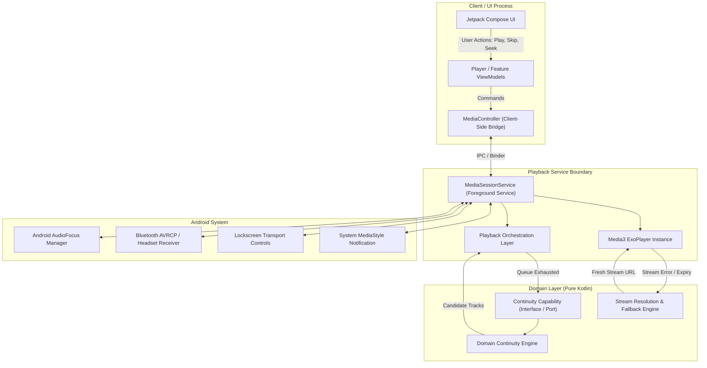

# SONARA ANDROID — PHASE 4A ARCHITECTURE DISCOVERY REPORT
### Architectural Discovery, Constraints & Alternatives Analysis (V1.2 — Final Integrity Pass)

---

## 1. Decision Status Legend

To maintain strict decision hygiene throughout the architecture phase, all architectural items and policies in this report use the following classification:

```
┌────────────────────────────────────────────────────────────────────────┐
│                        DECISION STATUS LEGEND                          │
├────────────────────────────────────────────────────────────────────────┤
│ 🟢 ESTABLISHED         Non-negotiable; decided prior to Phase 4A.      │
│ 🔵 RECOMMENDED         Strong architectural recommendation.            │
│ 🟡 OPEN                Requires Phase 4B analysis or human approval.   │
│ ⚪ IMPLEMENTATION DETAIL Must not be locked during Phase 4A.           │
│ 🟣 TUNABLE POLICY      Initial candidate value; tunable after testing. │
└────────────────────────────────────────────────────────────────────────┘
```

---

## 2. Executive Summary

### 2.1 Overview

This document is the complete, evidence-based **Architecture Discovery, Constraints, and Alternatives Analysis** for Sonara Android. It establishes the technical foundation required to fulfill the approved **Sonara Android — Requirements Specification V1.2** (approved product requirements source) while strictly honoring the foundational product principle:

> **Sonara Android is inspired by Sonara Web, not constrained by Sonara Web.**

This document is **purely analytical and exploratory**. It provides evidence-backed recommendations for Phase 4B (Architecture Specification) and does not constitute approved implementation decisions unless otherwise marked.

### 2.2 Core Architectural Thesis

Sonara Android requires an architecture optimized for **audio playback sovereignty, lifecycle resilience, rapid asynchronous skip handling, and zero-jank UI rendering**. The fundamental architectural strategy derived from this investigation is:

1. **Playback Sovereignty via Media3 Service Boundary** (🔵 *RECOMMENDED*): Audio playback execution, stream regeneration, and system notification management are decoupled from the UI lifecycle inside an Android `MediaSessionService`. The UI acts as an observer and command dispatcher, connected via a client-side `MediaController` boundary.
2. **Pragmatic Unidirectional Data Flow (UDF)** (🔵 *RECOMMENDED*): Presentation state is managed via discrete, immutable UI state models emitted by feature ViewModels, while playback state is observed from the authoritative Media3 playback provider.
3. **Isolated High-Frequency Observation** (🔵 *RECOMMENDED PRINCIPLE* / mechanism is 🟡 *OPEN*): Time-sensitive rendering (synchronized lyric highlighting and scrub bars) must be decoupled from broad Compose state trees to eliminate full-screen recomposition overhead. The exact isolation mechanism is deferred to Phase 4B.
4. **Platform-Independent Pure Domain Engines** (🔵 *RECOMMENDED*): Core musical intelligence — Search Quality Engine, Continuity Engine, Lyrics timing processor, and Indic transliteration tables — is structured as pure Kotlin logic with no Android framework dependencies, covered by comprehensive automated tests.
5. **Separated Persistence Responsibilities** (🔵 *RECOMMENDED*): Structured user data uses local relational persistence; user preferences use lightweight typed key-value stores; session recovery uses a separate atomic serialization strategy (mechanism 🟡 *OPEN*).
6. **Pragmatic Single-Module Structure** (🔵 *RECOMMENDED*): A single `:app` module with strict internal package boundaries to maximize build speed and open-source contributor velocity, with modularization deferred until objective architectural triggers are met.

---

## 3. Architecture Constraints

### 3.1 Platform SDK Context (🟢 *ESTABLISHED*)

| SDK Setting | Value | Notes |
| :--- | :--- | :--- |
| `minSdk` | **26** (Android 8.0 Oreo) | Ensures compatibility with modern notification channels, adaptive icons, and AudioFocus v2 APIs. Any API introduced after SDK 26 requires a version guard. |
| `targetSdk` | **35** (Android 15) | Full compliance with Android 15 window insets, Predictive Back, and background execution restrictions. |
| `compileSdk` | 🟡 **OPEN** | To be finalized in Phase 4B / Gradle configuration. |
| **Primary Test Device** | Xiaomi Redmi Note 12 Pro 5G — Android 14 / API 34 | The test device API (34) is **not** the application `minSdk`. All new API usage must be guarded to API 26. |

### 3.2 Playback & Operating System Constraints (🟢 *ESTABLISHED PLATFORM FACTS*)

- **Background Execution Sovereignty**: Android 14 (API 34+) enforces strict background service restrictions. Audio playback must execute inside a declared `MediaSessionService` with `foregroundServiceType="mediaPlayback"` and post an ongoing notification within OS-mandated timeouts.
- **Audio Focus & Hardware Interruptions**: The audio engine must handle transient and permanent audio focus changes (phone calls, navigation alerts, ducking) and must immediately halt playback when a headset is disconnected (`ACTION_AUDIO_BECOMING_NOISY`).
- **Stream Token Expiration**: Remote audio streams from third-party CDNs have short lifespans (typically hours). The architecture must handle HTTP 403/410 errors by transparently acquiring a fresh URL and resuming at the exact millisecond offset.
- **Rapid Skip Handling**: Users frequently tap "Next" multiple times in sub-second intervals. The architecture must immediately cancel in-flight network requests and audio buffer pipelines to avoid race conditions or out-of-order track transitions.
- **API Compatibility Guards**: APIs introduced above `minSdk = 26` require version checks. This includes modern AudioFocus APIs (API 26+), notification channels (API 26+), and foreground service media type declarations (API 34+).

### 3.3 Jetpack Compose Constraints (🟢 *ESTABLISHED UI FACTS*)

- **Unidirectional Data Flow (UDF)**: Compose is a declarative UI toolkit. State must flow down from ViewModels into Composable parameters; events (clicks, drags, seeks) must flow up.
- **Recomposition Optimization**: High-frequency state updates must be scoped tightly to leaf composables or custom draw phases to prevent triggering recomposition across the entire screen hierarchy.
- **Predictive Back & Insets**: The UI layer must natively support Android 15 edge-to-edge window insets and Predictive Back gesture transitions.

### 3.4 Domain & Intelligence Constraints (🟢 *ESTABLISHED PRODUCT FACTS*)

- **Search Quality Engine (SQE)**: Search ranking, title sanitization, and keyword penalty filtering must be deterministic, pure, and platform-independent.
- **Karaoke Lyrics Timing**: Word-level highlight calculations must decouple natural vocal cadence from arbitrary instrumental gaps and must execute on background threads.
- **Indic Transliteration**: Multi-script phonetic romanization must execute strictly on-demand to conserve battery and CPU resources.

---

## 4. Sonara Web Architectural Lessons

A critical review of the historical Sonara Web codebase revealed key failure modes and race conditions that directly inform the Android architectural constraints:

| # | Web Problem | Root Cause | Architectural Lesson | Android Constraint | What Android MUST Avoid |
| :--- | :--- | :--- | :--- | :--- | :--- |
| **1** | **Monolithic `PlayerContext` God Object** | A 570-line React context mixed audio execution, queue mutation, session storage, and analytics. | Audio playback execution must be strictly decoupled from UI state and queue governance. | Isolate playback inside a dedicated `MediaSessionService`; expose state to the UI side via a client-side `MediaController`. | Do NOT create a monolithic player controller that owns both UI and audio logic. |
| **2** | **Rapid Next Skip Race Conditions** | Fast skips triggered concurrent async stream resolutions; older resolutions overwrote newer ones out of order. | Async operations lacked structured cancellation. | Every track transition must cancel prior in-flight resolution jobs atomically using structured coroutine cancellation. | Do NOT allow un-scoped async resolution tasks to execute concurrently on the main playback pipeline. |
| **3** | **Artwork Rendering Waterfall & Blur Lag** | Background blurred artwork waited serially for the foreground image `onLoad` event. | Serial UI event coupling instead of parallel resource dispatch. | Foreground image loading, background blur generation, and palette extraction must launch concurrently. | Do NOT couple background atmospheric theming to foreground image loading completion. |
| **4** | **Speculative Network Flooding** | High-res image enhancement ran globally on every 48px list thumbnail, wasting 20–35 CDN calls per page load. | No surface-scoped asset loading policies. | List rows and grid cards request standard thumbnails only; high-res is strictly scoped to the Expanded Player surface. | Do NOT allow generic image composables to request high-resolution assets on compact list surfaces. |
| **5** | **Negative Cache Poisoning** | Temporary network glitches caused tracks to be permanently marked broken in local storage. | Indefinite negative caching without TTL or retry policies. | Failed stream and lyrics resolutions must use bounded, short-lived negative caches with exponential retry backoff. | Do NOT write permanent error flags to persistent disk storage for transient network failures. |
| **6** | **Lyrics Stretched Across Solos** | Naive duration division stretched word highlights across multi-bar guitar solos. | Coupling word timing to track duration rather than phonetic vocal weights. | Port the Natural Inertia algorithm as a pure Kotlin domain model enforcing hard gap caps. | Do NOT use linear time division across lyrics lines. |

---

## 5. Application Architecture Alternatives

We evaluate four structural architectural patterns for Sonara Android:

```
┌────────────────────────────────────────────────────────────────────────┐
│                 APPLICATION ARCHITECTURE ALTERNATIVES                  │
├────────────────────────────────────────────────────────────────────────┤
│ Option A: Full Clean Architecture (3-Layer, Heavy UseCase Boundary)    │
│   • UI ──> Presenter ──> UseCase ──> Repository ──> DataSource         │
│   • Dedicated UseCase per operation; 3 sets of data class mappers      │
├────────────────────────────────────────────────────────────────────────┤
│ Option B: Pragmatic Layered UDF (Recommended)                          │
│   • UI (Compose) ──> ViewModel (UDF) ──> Domain (Pure) ──> Repository  │
│   • UseCases only where genuine business logic exists (SQE, Continuity)│
│   • Canonical domain models; zero redundant mapping boilerplate        │
├────────────────────────────────────────────────────────────────────────┤
│ Option C: Pure MVI (Model-View-Intent, Single Global Reducer)          │
│   • Single monolithic AppState; single global reducer function         │
│   • All user actions dispatched through a single event queue           │
├────────────────────────────────────────────────────────────────────────┤
│ Option D: Traditional MVVM (without explicit Domain Boundary)          │
│   • Direct repository calls from ViewModels; no domain isolation       │
│   • Business logic accumulates inside ViewModels over time             │
└────────────────────────────────────────────────────────────────────────┘
```

### Comparative Evaluation

- **Option A (Full Clean Architecture, Heavy)**: Introduces massive file overhead. Creating `GetLikedSongsUseCase`, `AddFavoriteUseCase`, `RemoveFavoriteUseCase` with 3 sets of duplicate data classes violates Sonara's radical simplicity principle without adding meaningful architectural safety for a single-app music player.
- **Option C (Pure MVI Global Reducer)**: A single global state tree works poorly alongside an independent background playback service. High-frequency playback position ticks would force state evaluations across unrelated screens, defeating the purpose of the global reducer.
- **Option D (Traditional MVVM without Domain Boundary)**: Leads directly to business logic leaking into ViewModels — the same failure mode as the historical Web `PlayerContext`. Search filtering and lyrics timing become untestable without UI lifecycle mocks.
- **Option B (Pragmatic Layered UDF — 🔵 *RECOMMENDED*)**:
  - **UI Layer**: Jetpack Compose rendering immutable `UiState` and emitting `UiEvent`s.
  - **Presentation Layer**: Scoped ViewModels managing UI state, observing the MediaController.
  - **Domain Layer**: Pure Kotlin engines for genuine business logic only (SQE, Continuity, Lyrics, Transliteration). Simple CRUD flows directly through Repositories without forced UseCase indirection.
  - **Data Layer**: Repositories abstracting local persistence and remote network providers.

---

## 6. Playback Architecture & State Domain Ownership

### 6.1 State Domain Ownership Taxonomy

To prevent state tearing and desynchronization, each state domain has exactly one authoritative owner. Media3 is authoritative only for **actual audio playback state** — not for the entire application:

```
┌────────────────────────────────────────────────────────────────────────┐
│                   STATE DOMAIN OWNERSHIP TAXONOMY                      │
├────────────────────────────────────────────────────────────────────────┤
│ 1. Audio Playback Domain (Authoritative: Media3 / ExoPlayer)           │
│    • Actual Play / Pause / Buffering state                             │
│    • Current MediaItem & playback position                             │
│    • Active playlist timeline & repeat / shuffle playback modes        │
├────────────────────────────────────────────────────────────────────────┤
│ 2. Library & User Collection Domain (Authoritative: LibraryRepository) │
│    • Liked Songs (Favorites) & Playback History                        │
├────────────────────────────────────────────────────────────────────────┤
│ 3. Lyrics & Language Intelligence Domain (Authoritative: LyricsRepo)   │
│    • Synchronized LRC timestamps & romanization mappings               │
├────────────────────────────────────────────────────────────────────────┤
│ 4. Search & Discovery Domain (Authoritative: SearchViewModel / SQE)    │
│    • Ephemeral query strings & filtered / sanitized search results     │
├────────────────────────────────────────────────────────────────────────┤
│ 5. User Preferences Domain (Authoritative: SettingsRepository)         │
│    • Theme mode (Dark / Light / System), audio quality preference      │
└────────────────────────────────────────────────────────────────────────┘
```

### 6.2 Playback Subsystem Architecture (🔵 *RECOMMENDED*)

The key architectural boundary separates the **client / UI process** (which holds the `MediaController`) from the **playback service boundary** (which runs the `MediaSessionService` and `ExoPlayer`). The `MediaController` is a **client-side** bridge — it belongs to the application/UI side, not to the service's internal implementation.

The `ContinuityEngine` is a **pure domain capability** invoked by the playback orchestration layer. It does not depend on Android infrastructure. The playback orchestration layer depends on the domain capability through an abstraction, preserving the domain boundary.



---

## 7. State Synchronization Model

| State Property | Authoritative Owner | Primary Writer | Primary Observers | Synchronization Mechanism | Status |
| :--- | :--- | :--- | :--- | :--- | :--- |
| **Actual Playback State** (Playing/Paused/Buffering) | Media3 / ExoPlayer | `PlaybackService` | Transport Controls, Mini Player, System Notification | `Player.Listener.onPlaybackStateChanged` | 🔵 *RECOMMENDED* |
| **Current Track MediaItem** | Media3 / ExoPlayer | `PlaybackService` | Mini Player, Expanded Player, Lockscreen | `Player.Listener.onMediaItemTransition` | 🔵 *RECOMMENDED* |
| **Active Queue Timeline** | Media3 / ExoPlayer | UI / Continuity Orchestrator | Queue Sheet, Player ViewModels | `Player.Listener.onTimelineChanged` | 🔵 *RECOMMENDED* |
| **Playback Position (High-Freq)** | Hardware Audio Clock | Media3 internally | Progress Scrubber, Lyrics Highlight | 🟡 *OPEN — mechanism chosen in Phase 4B* | 🟡 *OPEN* |
| **Liked Songs / Favorites** | `LibraryRepository` | User Heart Actions | Track Lists, Expanded Player Heart | Reactive local DB `Flow` | 🔵 *RECOMMENDED* |
| **Search Query & Results** | `SearchViewModel` | User Keyboard / SQE | Search Screen Results | `StateFlow<SearchUiState>` | 🔵 *RECOMMENDED* |
| **Active Theme Mode** | `SettingsRepository` | User Preferences | Root `SonaraTheme` Composable | `StateFlow<ThemeMode>` | 🔵 *RECOMMENDED* |

---

## 8. High-Frequency Playback Position — Isolation Requirement & Candidate Approaches

### 8.1 The Architectural Requirement (🔵 *RECOMMENDED PRINCIPLE*)

During playback, the current playback position advances continuously. If this is exposed as a standard `StateFlow<Long>` collected at a top-level composable, the entire screen hierarchy recomposes at 60–120 Hz, creating catastrophic battery drain, CPU spikes, and dropped frames.

**Requirement**: High-frequency playback position observation must not cause unnecessary broad screen recomposition.

**Principle**: Continuous playback-time observation must be scoped to the smallest UI surface that requires it, and must suspend automatically when those surfaces are off-screen.

### 8.2 Candidate Approaches (🟡 *OPEN — Phase 4B will decide*)

1. **Candidate A — Frame-Ticked Provider with Lifecycle Scoping**: A dedicated provider ticks only when subscriber composables are visible on-screen, broadcasting to leaf nodes.
2. **Candidate B — Compose Draw-Phase Interpolation**: Scrub bar and ring progress update exclusively in the Compose draw phase via custom `Modifier.drawWithContent`, bypassing layout and measure passes entirely.
3. **Candidate C — Coroutine-Driven Timestamp Interpolation**: Progress is interpolated from MediaController position snapshots using elapsed-time deltas, reducing the raw tick frequency needed from Media3.

*Phase 4B will benchmark candidates against the primary physical test device (Redmi Note 12 Pro, Android 14) and specify the exact mechanism.*

---

## 9. Domain Layer Analysis

The Domain layer is 100% pure Kotlin. It contains zero dependencies on the Android SDK, AndroidX, Compose, or Media3. The `ContinuityEngine` exposes its capability through an interface/port boundary so that the playback orchestration layer can invoke it without the domain depending on Android infrastructure.

```
Sonara Domain Layer (Pure Kotlin — Zero Android Framework Dependencies)
├── search/
│   ├── SearchQualityEngine          # Deterministic keyword scoring, penalties, outlier filter
│   └── TitleSanitizer               # Unicode emoji and promotional bracket stripping
├── continuity/
│   ├── ContinuityEngine             # Context snapshotting and candidate track ranking
│   └── ContinuityScoringStrategy    # Seed affinity & artist fatigue mathematical weights
├── lyrics/
│   ├── NaturalInertiaProcessor      # Vocal duration heuristic calculation & gap decoupling
│   └── LrcParser                    # Synchronized LRC timestamp parser
├── transliteration/
│   ├── IndicTransliterationEngine   # 8-Script phonetic character mapping engine
│   └── ReadabilityOverrides         # Common music vocabulary pronunciation dictionary
└── model/
    ├── Track                        # Canonical immutable song domain model
    ├── Lyrics                       # Synchronized line and word timing domain model
    ├── SearchResult                 # Clean categorized search domain model
    └── Queue                        # Active playback queue domain model
    (Playlist — Post-MVP domain concept, not currently required)
```

---

## 10. Data Architecture & Provider Abstraction

```
┌────────────────────────────────────────────────────────────────────────┐
│                     DATA LAYER ARCHITECTURE                            │
├────────────────────────────────────────────────────────────────────────┤
│                     Repository Interfaces                              │
│   MusicRepository  LyricsRepository  LibraryRepository  SettingsRepo  │
├──────────────────────────────┬─────────────────────────────────────────┤
│      Remote Data Sources     │         Local Data Sources              │
├──────────────────────────────┼─────────────────────────────────────────┤
│ • YTMusic Extraction Source  │ • Library Local Source (Relational DB)  │
│ • JioSaavn Extraction Source │ • Preferences Data Source               │
│ • LRCLIB Lyrics Source       │ • Local Device Media Store Source       │
│ • Artwork Remote Source      │ • Ephemeral In-Memory Cache             │
└──────────────────────────────┴─────────────────────────────────────────┘
```

### Architectural Requirements (🔵 *RECOMMENDED*)
- **Provider Isolation**: Third-party APIs (YouTube Music, JioSaavn, LRCLIB) are abstracted behind data source interfaces. No provider-specific detail leaks past the repository boundary.
- **Zero DTO Leakage**: Raw API responses are mapped to clean domain models at the data source boundary. ViewModels and UI never see third-party response shapes.
- **Graceful Fallback**: If the primary audio resolution source fails, the `MusicRepository` attempts secondary provider extraction before surfacing an unrecoverable error.

---

## 11. Networking Architecture & Implementation Candidates

### 11.1 Architectural Requirements (🔵 *RECOMMENDED PRINCIPLES*)
- Structured coroutine cancellation on rapid user skips.
- Interceptor-driven header and authentication injection.
- Transparent JSON deserialization into immutable domain models.
- No provider-specific networking detail leaking past the data source boundary.

### 11.2 Technology Candidates

| Dimension | Option A: Retrofit + OkHttp | Option B: Ktor Client | Option C: OkHttp + Kotlinx Serialization | Option D: Fuel / Other |
| :--- | :--- | :--- | :--- | :--- |
| **Dependency Footprint** | Moderate (Retrofit + OkHttp + Converter) | Moderate (Ktor core + engine + json) | **Minimal** (OkHttp + KX Serialization) | Varies |
| **Media3 Synergy** | OkHttp underneath | ByteReadChannel adapter needed | **Native OkHttp DataSource in Media3** | Unlikely |
| **Reflection-Free Parsing** | Requires Gson/Moshi setup | KX Serialization available | **Native KX Serialization (compiler plugin)** | Varies |
| **Coroutine Cancellation** | Supported via OkHttp Call | Native | Native `Call.cancel()` | Varies |
| **Recommendation** | Viable secondary option | Viable for future KMP | **🔵 PREFERRED CANDIDATE** | ❌ Not evaluated |

---

## 12. Persistence Responsibilities & Technology Candidates

### 12.1 Storage Responsibility Model

```
┌────────────────────────────────────────────────────────────────────────┐
│                   PERSISTENCE RESPONSIBILITY MODEL                     │
├────────────────────────────────────────────────────────────────────────┤
│ 1. Structured Relational Data                                          │
│    • Liked songs, playback history (MVP)                               │
│    • Custom playlists (Post-MVP, schema designed in Phase 4B)          │
│    • Technology Candidate: Relational DB (🔵 Room — PREFERRED)         │
├────────────────────────────────────────────────────────────────────────┤
│ 2. Typed User Preferences                                              │
│    • Theme mode, audio quality tier, romanization default             │
│    • Technology Candidate: Typed Key-Value Store (🔵 DataStore — PREF) │
├────────────────────────────────────────────────────────────────────────┤
│ 3. Session Recovery State                                              │
│    • Active track ID, queue array, playback position offset           │
│    • Requirement: Must survive process death  (🔵 RECOMMENDED)         │
│    • Serialization mechanism: 🟡 OPEN — decided in Phase 4B            │
└────────────────────────────────────────────────────────────────────────┘
```

---

## 13. Dependency Injection Alternatives

| Dimension | Option A: Manual DI (`AppContainer`) | Option B: Koin | Option C: Hilt / Dagger |
| :--- | :--- | :--- | :--- |
| **Build Overhead** | **Zero** (Pure Kotlin constructor calls) | **Zero** (Service locator DSL) | High (KSP / KAPT annotation processing) |
| **Compile-Time Safety** | **100%** (Kotlin compiler validates) | Runtime resolution (crashes if missing) | 100% (Dagger graph validated at compile) |
| **Contributor Friendliness** | **Exceptional** (No frameworks to learn) | Good | Steep learning curve; verbose annotations |
| **App Complexity Match** | **Ideal for Sonara** (~15 total singletons) | Viable alternative | Overkill for single-app music player MVP |
| **Status** | 🔵 *PREFERRED CANDIDATE* | 🟡 *Viable Alternative* | Not recommended |

---

## 14. Navigation Architecture Alternatives

| Dimension | Option A: Jetpack Navigation Compose | Option B: Custom Backstack | Option C: Third-Party (Voyager / Circuit) |
| :--- | :--- | :--- | :--- |
| **Platform Standard** | Official Android Jetpack library | Custom state container | Third-party framework |
| **Predictive Back** | **Native** (Android 14/15 back animations) | Requires manual gesture handling | Varies by library version |
| **Type Safety** | Native Type-Safe routes (Navigation Compose 2.8+) | Custom sealed classes | Built-in (varies) |
| **Recommendation** | 🔵 *PREFERRED CANDIDATE* | 🟡 Viable | ❌ Unnecessary dependency |

---

## 15. Project Structure Alternatives & Modularization Triggers

### 15.1 Single-Module Recommendation (🔵 *RECOMMENDED*)

Sonara Android starts with a single `:app` module enforcing strict internal package boundaries:

```
[SONARA_APPLICATION_PACKAGE]           (🟡 Package name — OPEN, decided in Phase 4B)
├── di/                                # Manual Dependency Injection containers
├── domain/                            # Pure Kotlin Domain Engines & Models
│   ├── model/                         # Canonical domain models (Track, Lyrics, Queue)
│   ├── search/                        # Search Quality Engine & Title Sanitizer
│   ├── continuity/                    # Continuity Engine & Scoring Strategies
│   ├── lyrics/                        # Natural Inertia Lyrics Timing Engine
│   └── transliteration/               # 8-Script Indic Phonetic Transliteration Engine
├── data/                              # Data Layer Implementations
│   ├── repository/                    # Concrete Repositories
│   ├── local/                         # Local persistence sources (DB, DataStore)
│   ├── remote/                        # Remote data sources (extraction clients)
│   └── mapper/                        # API response ↔ Domain model mappers
├── playback/                          # AndroidX Media3 / ExoPlayer Subsystem
│   ├── service/                       # Foreground MediaSessionService
│   ├── controller/                    # Client-side MediaController bridge
│   ├── clock/                         # High-frequency position provider (mechanism OPEN)
│   └── notification/                  # MediaStyle notification handlers
└── ui/                                # Jetpack Compose Presentation Layer
    ├── theme/                         # Sonara Material 3 Theme (Petrol/Bone/Oxide)
    ├── navigation/                    # Type-Safe Navigation Graph & Routes
    ├── components/                    # Shared Compose UI Primitives
    ├── home/                          # Home / Discover screen & ViewModel
    ├── search/                        # Search screen & SearchViewModel
    ├── library/                       # Liked Songs, History & LibraryViewModel
    ├── player/                        # Mini Player, Expanded Player & PlayerViewModel
    └── lyrics/                        # Synchronized Lyrics screen & LyricsViewModel
```

> **Package Name**: The application reverse-domain package identifier (`com.*.*`) is **🟡 OPEN**. The placeholder `[SONARA_APPLICATION_PACKAGE]` is used throughout this document. The actual identifier will be finalized during Phase 4B project identity specification.

### 15.2 Objective Modularization Triggers

The project moves to multi-module only when one of the following objective triggers is confirmed:

1. **Build Time Degradation**: Incremental build time reaches a developer-agreed threshold that multi-module parallelization would meaningfully reduce.
2. **Strict Compilation Isolation Required**: A domain engine must be provably isolated from accidental framework imports (e.g., Lint rules are insufficient and Gradle visibility is needed).
3. **Dynamic Delivery**: A feature requires on-demand APK delivery or separate distribution.
4. **Independent Team Ownership**: Multiple teams require isolated code ownership with separate review boundaries.

---

## 16. Caching Strategy & Tunable Policies

```
┌────────────────────────────────────────────────────────────────────────┐
│                CACHING STRATEGY & TUNABLE POLICIES                     │
├────────────────────────────────────────────────────────────────────────┤
│ 1. Artwork Images                                                      │
│    • In-Memory: LRU bitmap cache                                       │
│      🟣 Initial Policy: ~25% available RAM ceiling                     │
│    • Disk: Bounded LRU disk cache                                      │
│      🟣 Initial Policy: ~250MB ceiling with automatic eviction         │
├────────────────────────────────────────────────────────────────────────┤
│ 2. Lyrics Payloads (LRCLIB Data)                                       │
│    • In-Memory: Bounded LRU cache                                      │
│      🟣 Initial Policy: last ~50 played tracks                         │
│    • Disk: Cached response table                                       │
│      🟣 Initial Policy: ~30-day TTL; purged on engine version change   │
├────────────────────────────────────────────────────────────────────────┤
│ 3. Remote Stream URLs (Audio Playback Links)                           │
│    • In-Memory ONLY: Short-lived positive cache                        │
│      🟣 Initial Policy: ~4-hour TTL                                    │
│    • Negative (broken URL) cache: Bounded, short-lived                 │
│      🟣 Initial Policy: ~15-minute retry backoff                       │
│    • Disk: NEVER persisted (prevents expired token playback)           │
├────────────────────────────────────────────────────────────────────────┤
│ 4. Search Query Results                                                │
│    • In-Memory ONLY: Ephemeral session cache (cleared on exit)         │
└────────────────────────────────────────────────────────────────────────┘
```

> All cache limits and TTL values are 🟣 **Initial Policy Candidates** subject to measurement and tuning during on-device profiling. They are not immutable architectural decisions.

---

## 17. Lifecycle & Process Death Analysis

Sonara distinguishes five discrete lifecycle events, each with a different survival strategy:

| Lifecycle Event | What Happens to UI | Audio Playback | Survival Mechanism |
| :--- | :--- | :--- | :--- |
| **A. Compose / UI Recreation** (Rotation, Theme change) | Composable tree destroyed & recreated. | Uninterrupted. | ViewModel `viewModelScope` + `rememberSaveable`. |
| **B. Activity Recreation** (Configuration change) | Activity destroyed & recreated. | Uninterrupted. | `MediaController` re-binds to active `MediaSessionService`. |
| **C. App Backgrounded / Screen Off** | UI suspended / invisible. | Uninterrupted. | Foreground `MediaSessionService` with OS wakelock. |
| **D. Process Death** (OS reclaims RAM) | Entire process terminated. | Stops. Session must be recoverable. | Atomic session snapshot before process death. Mechanism: 🟡 OPEN. |
| **E. Device Reboot** | System restarts entirely. | Stops. Library data must be durable. | Relational DB (Liked songs, history) + Preferences (settings). |

> **Session Recovery Requirement** (🔵 *RECOMMENDED*): Active track identity, queue state, and playback offset must be serializable and restorable after process death (Event D). The exact serialization format and storage location are 🟡 **OPEN** for Phase 4B specification.

---

## 18. Testing Architecture

```
┌────────────────────────────────────────────────────────────────────────┐
│                          TESTING ARCHITECTURE                          │
├────────────────────────────────────────────────────────────────────────┤
│ 1. Pure Unit Tests (Fast JVM, Zero Android SDK Mocks)                  │
│    • SearchQualityEngine: Keyword penalties, sanitization rules.       │
│    • NaturalInertiaProcessor: Vocal duration math, gap decoupling.     │
│    • IndicTransliterationEngine: 8-Script phonetic character mappings. │
│    • ContinuityEngine: Seed affinity and queue refill logic.           │
│    Core domain engines must be covered by comprehensive automated tests│
├────────────────────────────────────────────────────────────────────────┤
│ 2. Data & Repository Tests (JVM with MockWebServer / Fakes)            │
│    • MusicRepository: Fallback provider routing, stream retries.       │
│    • LyricsRepository: LRCLIB parsing, cache hit/miss flows.           │
│    • Local DB DAO Tests (In-memory database fixture).                  │
├────────────────────────────────────────────────────────────────────────┤
│ 3. Playback State Tests (Media3 Test Utilities)                        │
│    • Rapid skip cancellation: Atomic job cancellation verification.    │
│    • Stream regeneration: Mid-track HTTP 403 recovery validation.      │
├────────────────────────────────────────────────────────────────────────┤
│ 4. UI & Screenshot Tests (Compose Test Rule)                           │
│    • Mini Player, Expanded Player, Synchronized Lyrics composables.    │
│    • Real-device validation on Redmi Note 12 Pro (Android 14 / API 34) │
└────────────────────────────────────────────────────────────────────────┘
```

---

## 19. Alternatives Comparison Matrix

| Architectural Dimension | Option A | Option B | Option C | Option D | Proposed Candidate | Status |
| :--- | :--- | :--- | :--- | :--- | :--- | :--- |
| **Application Architecture** | Full Clean (Heavy) | Pragmatic Layered UDF | Pure MVI Global Reducer | Traditional MVVM (No Domain) | **Pragmatic Layered UDF** | 🔵 *RECOMMENDED* |
| **Playback Boundary** | UI-bound ExoPlayer | `MediaSessionService` + `MediaController` | Custom Android Service | — | **`MediaSessionService` + `MediaController`** | 🔵 *RECOMMENDED* |
| **High-Frequency Clock** | Global `StateFlow` | Frame-ticked Provider | Draw-Phase Interpolation | Coroutine Delta Interpolation | **TBD in Phase 4B** | 🟡 *OPEN* |
| **Networking** | Retrofit + OkHttp | Ktor Client | OkHttp + KX Serialization | Fuel / Other | **OkHttp + KX Serialization** | 🔵 *RECOMMENDED* |
| **Persistence (Relational)** | Raw SQLite | Room | SQLDelight | — | **Room** | 🔵 *RECOMMENDED* |
| **Persistence (Preferences)** | SharedPreferences | DataStore Preferences | DataStore Proto | — | **DataStore Preferences** | 🔵 *RECOMMENDED* |
| **Session Recovery Mechanism** | JSON file in cache | DataStore Proto | Room table | — | **TBD in Phase 4B** | 🟡 *OPEN* |
| **Dependency Injection** | Hilt / Dagger | Koin | Manual DI (`AppContainer`) | — | **Manual DI** | 🔵 *RECOMMENDED* |
| **Navigation** | Navigation Compose (Type-Safe) | Custom Stack | Third-Party | — | **Navigation Compose 2.8+** | 🔵 *RECOMMENDED* |
| **Project Structure** | Multi-Module Layered | Multi-Module Feature | Single-Module (Package-Isolated) | — | **Single-Module** | 🔵 *RECOMMENDED* |
| **Image Loading** | Glide | Picasso | Coil 2.x / 3.x | — | **Coil** | 🔵 *RECOMMENDED* |

---

## 20. Architectural Risks & Preventive Rules

| # | Architectural Risk | Why It Could Happen | Preventive Rule |
| :--- | :--- | :--- | :--- |
| **1** | **God Player Manager** | Developer convenience accumulates queue, audio, UI state, and network logic in one class. | Playback service owns audio execution. `MusicRepository` owns track resolution. ViewModels own UI interaction. No component may own more than one of these. |
| **2** | **Duplicated Playback State** | Storing active track metadata separately in ViewModels and in Media3 leads to desynchronization. | ViewModels never hold independent playback state. They observe the `MediaController` directly as the authoritative source. |
| **3** | **High-Frequency Recomposition Storms** | Binding lyric highlights or scrub bars to top-level composable state causes 60Hz full-screen recompositions. | Continuous time observers must be scoped exclusively to leaf canvas / draw nodes. The root screen composable must never collect high-frequency playback position. |
| **4** | **Domain Leaking Android Dependencies** | Importing `android.content.Context` or AndroidX classes into Domain engines makes them untestable on standard JVMs. | The `domain/` package must contain zero imports from `android.*` or `androidx.*`. Verified by Lint rules. |
| **5** | **Premature Multi-Module Overhead** | Splitting a small app into many Gradle modules slows build times and creates configuration churn. | Maintain a single `:app` module until a concrete, measurable architectural trigger justifies modularization. |
| **6** | **Infrastructure Coupling ContinuityEngine** | A direct Android service-to-domain-class dependency violates the domain independence principle. | The playback orchestration layer invokes continuity capability through an interface/port boundary. The `ContinuityEngine` implementation has no dependency on Android infrastructure. |

---

## 21. Sonara Android Architectural Anti-Patterns

The following patterns are **strictly prohibited** in the Sonara Android architecture:

1. ❌ **No UI-Owned Audio Execution**: Never instantiate ExoPlayer inside an Activity, ViewModel, or Composable. Audio belongs exclusively inside the `MediaSessionService` boundary.
2. ❌ **No Monolithic Global State Objects**: Never create a global singleton holding all application UI states. State must be feature-scoped and lifecycle-aware.
3. ❌ **No Async Operations Without Structured Cancellation**: Never launch background network calls without an attached structured `CoroutineScope` that cancels automatically on user skip.
4. ❌ **No Permanent Negative Caching**: Never write permanent error flags to persistent disk storage for transient network failures.
5. ❌ **No Domain Classes Depending on Android Framework**: The `domain/` layer must be pure Kotlin. Any class importing from `android.*` or `androidx.*` does not belong in the domain layer.
6. ❌ **No Blocking Calls on the Main Thread**: All disk I/O, database queries, and network serialization must execute on background dispatchers.
7. ❌ **No High-Frequency State at Root Composable Scope**: Playback position or lyric word index must never be held in a state that triggers full-tree recomposition.

---

## 22. Recommended High-Level Architecture

The following diagram shows conceptual boundaries only. Technology selections (Room, OkHttp, Coil, etc.) are documented in the alternatives sections and the Decision Register; they do not appear in this boundary diagram because they are recommended candidates, not locked architectural facts.

```
┌──────────────────────────────────────────────────────────────────────────────┐
│                         PRESENTATION LAYER (UI)                              │
│  Jetpack Compose — Material 3 — Sonara Petrol / Bone / Oxide Design Language │
│                                                                              │
│  • Feature Screens (Home, Search, Library)                                   │
│  • Player Surfaces (Mini Player, Expanded Player, Lyrics Screen)             │
│  • Type-Safe Navigation (Predictive Back, Edge-to-Edge Insets)               │
│  • Scoped ViewModels emitting immutable UiState                              │
│  • Leaf-level isolated rendering for continuous playback-position updates    │
└────────────────────────────────────┬─────────────────────────────────────────┘
                                     │  Commands up / UiState down
                                     ▼
┌──────────────────────────────────────────────────────────────────────────────┐
│                          DOMAIN LAYER (Pure Kotlin)                          │
│                                                                              │
│  • Search Quality Engine        (deterministic ranking & noise filtering)    │
│  • Playback Continuity Engine   (context snapshotting & candidate scoring)   │
│  • Lyrics Timing Engine         (Natural Inertia vocal cadence calculation)  │
│  • Indic Transliteration Engine (8-script phonetic character mapping)        │
│  • Canonical Domain Models      (Track, Lyrics, Queue, SearchResult)         │
└───────────┬────────────────────────────────────────┬─────────────────────────┘
            │                                        │
     Domain capability                     Fetch / Persist
     invoked through port                            │
            ▼                                        ▼
┌───────────────────────────┐  ┌──────────────────────────────────────────────┐
│  PLAYBACK SERVICE         │  │  DATA LAYER (Repositories)                   │
│  BOUNDARY                 │  │                                              │
│  (Foreground Service)     │  │  • Music Repository      (stream resolution) │
│                           │  │  • Lyrics Repository     (LRCLIB)            │
│  • Media3 ExoPlayer       │  │  • Library Repository    (Liked / History)   │
│  • Playback Orchestration │  │  • Settings Repository   (Preferences)       │
│  • System Notification    │  │                                              │
│  • Lockscreen Controls    │  │  Remote Data Sources                         │
│  • Audio Focus            │  │  • Provider Extraction Clients               │
│  • Bluetooth AVRCP        │  │  Local Data Sources                          │
│                           │  │  • Relational Persistence                    │
│  ↑                        │  │  • Typed Preferences Store                   │
│  MediaController          │  │  • Local Media Store                         │
│  (Client-side, in UI      │  │  • Ephemeral In-Memory Cache                 │
│   process — see §6.2)     │  └──────────────────────────────────────────────┘
└───────────────────────────┘
```

---

## 23. Architectural Principles

1. **Audio Playback is Sovereign**: Audio execution survives all UI lifecycles, configuration changes, and background transitions.
2. **Media3 is Authoritative for Playback State**: UI components observe playback state; they never duplicate or independently dictate it.
3. **High-Frequency Time Does Not Invalidate the Screen**: Playback position updates are isolated to the smallest leaf rendering surface that requires them.
4. **Pure Domain Logic is Platform-Independent**: Core business engines have zero Android framework dependencies and are covered by comprehensive automated tests.
5. **Domain Capability is Invoked Through Boundaries**: Android infrastructure (services, repositories) invokes domain engines via interfaces/ports. Domain engines never depend on infrastructure.
6. **Radical Simplicity & YAGNI**: No speculative layers, no unnecessary DTO mappers, and no premature multi-module overhead.
7. **Local Ownership & Zero Bloat**: User data resides on-device; zero third-party tracking or telemetry SDKs.

---

## 24. Architectural Decision Register

| Architectural Area | Current Position | Status | Phase 4B Action |
| :--- | :--- | :--- | :--- |
| **Application Architecture** | Pragmatic Layered UDF | 🔵 *RECOMMENDED* | Finalize layer boundaries and mapper policies. |
| **UI State Management** | Scoped UDF `StateFlow` per feature | 🔵 *RECOMMENDED* | Define base `UiState` and `UiEvent` interfaces. |
| **Playback Boundary** | `MediaSessionService` + client-side `MediaController` | 🔵 *RECOMMENDED* | Specify Binder IPC contracts, notification actions, focus interceptors. |
| **Playback State Ownership** | Media3 authoritative for audio; repos for each domain | 🔵 *RECOMMENDED* | Map exact event listeners and state flow subscriptions. |
| **High-Frequency Position Clock** | Isolated from broad state; exact mechanism open | 🟡 *OPEN* | Benchmark candidates; specify chosen mechanism. |
| **Domain Boundary** | Pure Kotlin, zero Android imports | 🔵 *RECOMMENDED* | Define exact public engine interfaces and port contracts. |
| **ContinuityEngine Invocation** | Via interface/port boundary from orchestration layer | 🔵 *RECOMMENDED* | Define the port interface in Phase 4B. |
| **Networking Client** | OkHttp + Kotlinx Serialization | 🔵 *RECOMMENDED* | Specify client configuration, headers, and interceptors. |
| **Relational Persistence** | Room Database | 🔵 *RECOMMENDED* | Define entity schemas and DAO contracts. |
| **Preferences Storage** | DataStore Preferences | 🔵 *RECOMMENDED* | Define preference keys and migration strategy. |
| **Session Recovery** | Recovery required; serialization mechanism open | 🟡 *OPEN* | Specify serialization format and storage location. |
| **Dependency Injection** | Manual DI via `AppContainer` | 🔵 *RECOMMENDED* | Design `AppContainer` wiring and ViewModel factories. |
| **Navigation Framework** | Navigation Compose 2.8+ (Type-Safe Routes) | 🔵 *RECOMMENDED* | Define route sealed hierarchy and argument schemas. |
| **Project Structure** | Single-Module (`:app`) with strict package layout | 🔵 *RECOMMENDED* | Specify exact package names once package identifier is decided. |
| **Application Package ID** | Not yet decided | 🟡 *OPEN* | Finalize reverse-domain identifier in Phase 4B. |
| **`compileSdk` version** | Not yet decided | 🟡 *OPEN* | Finalize in Phase 4B Gradle configuration. |
| **Image Loading Library** | Coil 2.x / 3.x | 🔵 *RECOMMENDED* | Specify version, OkHttp integration, and cache configuration. |
| **Caching Limits & TTLs** | Initial tunable policies defined | 🟣 *TUNABLE* | Validate against on-device profiling before hardening. |
| **Testing Architecture** | JVM Unit Tests + Media3 Fixtures + Compose Tests | 🔵 *RECOMMENDED* | Define test suite structure and mock/fake strategies. |

---

## 25. Phase 4B — Established Foundations (What Phase 4B Must NOT Reopen)

The following are **non-negotiable established decisions** that Phase 4B will build upon:

- **Language**: Kotlin.
- **UI Toolkit**: Jetpack Compose.
- **Design System Foundation**: Material 3.
- **Visual Identity**: Petrol / Bone / Oxide palette with a custom Sonara Material 3 theme.
- **Audio Playback Engine**: AndroidX Media3 / ExoPlayer.
- **SDK Baseline**: `minSdk = 26`, `targetSdk = 35`.
- **Primary Test Device**: Xiaomi Redmi Note 12 Pro (Android 14 / API 34).
- **Product Strategy**: Open-Source, Privacy-First, Android-First Music Application.
- **Web Reference Boundary**: Sonara Web is an inspiration and engineering reference, NOT an architectural template.

---

## 26. Phase 4B — Architectural Decisions to Finalize

Phase 4B will formalize and specify the following technical contracts:

1. **Application Package Identifier**: Reverse-domain name (`com.*.*`).
2. **`compileSdk` Version**: Exact SDK compilation target.
3. **Exact Playback Service & Controller Contract**: Notification configuration, audio focus interceptors, and event dispatcher contracts.
4. **State Ownership & Propagation Schemas**: Concrete `StateFlow` types, UI event channels, and ViewModel structures.
5. **High-Frequency Clock Mechanism**: Concrete selection and implementation specification from the three candidates.
6. **Domain Engine Public Interfaces**: Exact Kotlin function signatures for SQE, NaturalInertia, IndicTransliteration, and ContinuityEngine.
7. **ContinuityEngine Port Interface**: The interface/port definition allowing playback orchestration to invoke the domain engine without an Android dependency.
8. **Data Layer Contracts**: Kotlin interfaces for all repositories and data sources.
9. **Database Schema**: Room `@Entity` and `@Dao` definitions for Liked Songs, History, and Lyrics cache.
10. **Session Recovery Schema**: Serialization format, storage location, and restoration flow.
11. **DataStore Preference Keys**: All typed preference key definitions.
12. **`AppContainer` Dependency Graph**: Singleton wiring and ViewModel factory designs.
13. **Type-Safe Navigation Routes**: Route sealed hierarchy and argument serialization.
14. **Gradle Dependency Specifications**: Exact library artifact coordinates and versions for Phase 5 project setup.

---

## 27. Sources & Evidence Used

- **Approved Product Requirements**: Sonara Android — Requirements Specification V1.2 *(approved requirements source; not yet saved as a project file)*.
- **Artwork Quality & Forensic Audit**: `Melodify_Artwork_Rendering_Forensic_Audit_V5.md` (Web reference — read-only).
- **Domain Intelligence RFC**: `architecture/rfc/RFC-001-Sonara-Music-Intelligence-Domain-Model.md` (Web reference — read-only).
- **Search Quality Engine**: `backend/features/music/SearchQualityEngine.js` (Web reference — read-only).
- **Lyrics & Transliteration Algorithms**: `services/lyrics/lyricsProcessor.js` and `services/transliteration/core.js` (Web reference — read-only).
- **Android Platform Documentation**: AndroidX Media3 1.x `MediaSessionService` contracts and Android 14 `FOREGROUND_SERVICE_MEDIA_PLAYBACK` permission requirements.

---

## Appendix A — Phase 4A Tooling & Research Methodology

*This appendix documents the development tools, MCP servers, and skills used during Phase 4A architecture discovery. It is preserved as an audit trail of the research methodology and is not permanent architectural content.*

| Tool / Resource | Category | Capability | Status for Phase 4A | Rationale |
| :--- | :--- | :--- | :--- | :--- |
| **`sequential-thinking`** | MCP Server | Structured multi-step reasoning and trade-off analysis. | Used | Modeled state synchronization lifecycles, playback boundaries, and dependency matrices. |
| **`view_file` / `list_dir` / `find_by_name`** | Builtin Tools | Read-only file inspection of the Web reference repository. | Used | Inspected SQE rules, lyrics processor algorithms, V5 artwork audit, and domain model RFCs. |
| **`android-cli`** | Plugin Skill | Android platform contracts and SDK capability reference. | Used (Reference) | Verified Android 14 (API 34) foreground service compliance and system audio focus rules. |
| **`ponytail`** | Plugin Skill | Anti-overengineering guardrails and YAGNI enforcement. | Used | Applied throughout to prevent unnecessary multi-module structures and speculative abstractions. |
| **`context7`** | MCP Server | External library documentation resolver. | Used (Reference) | Cross-referenced AndroidX Media3 1.x `MediaSessionService` and Compose state primitives. |
| **`serena`** | MCP Server | AST code navigation and semantic refactoring. | Not used — Reserved | Reserved for implementation phases (Phase 6+). |
| **`stitch`** | MCP Server | UI design system and visual token generation. | Not used — Reserved | Reserved for Phase 7 (Design System Architecture). |
| **`code-refactoring-refactor-clean`** | Skill | Clean code and SOLID pattern auditing. | Not used — Reserved | Reserved for Phase 11 code review. |
| **`playwright` / `reticle`** | MCP Servers | Headless browser execution and DOM testing. | Not relevant | Web-only DOM automation; out of scope for native Android architecture. |
